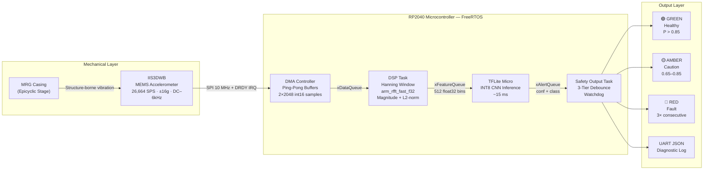
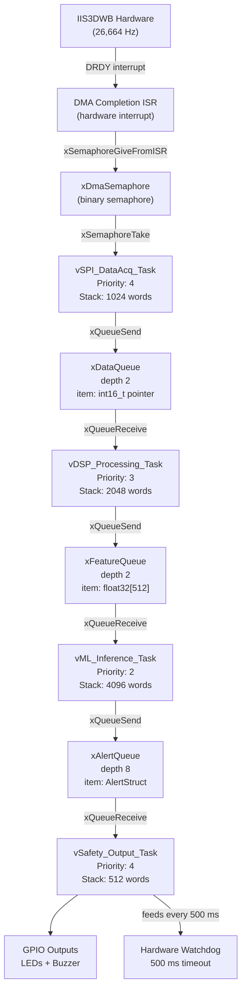
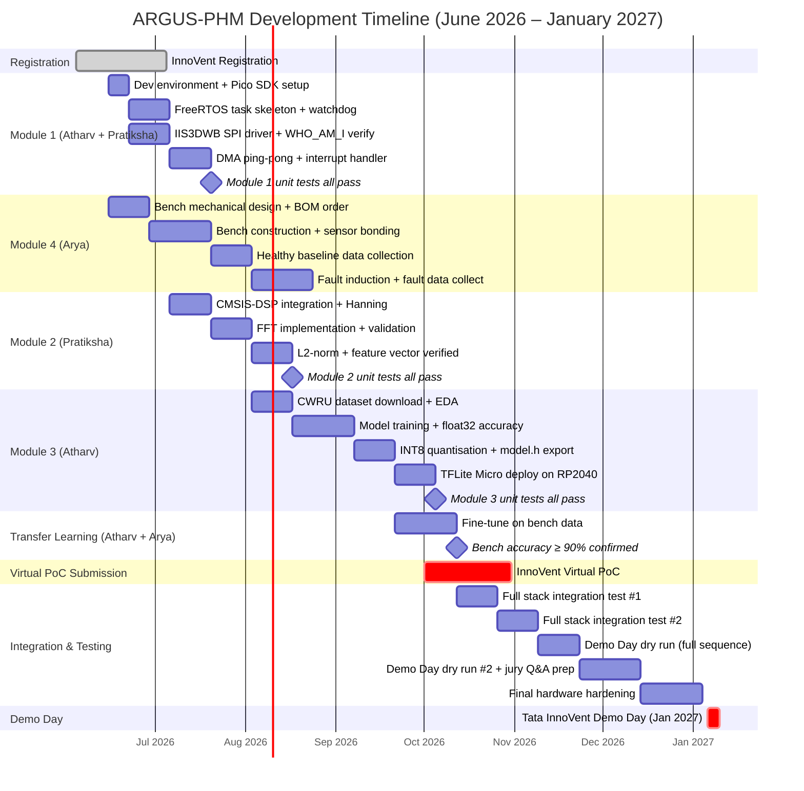

# ARGUS-PHM: Technical Reference Document
## Edge-Optimized Real-Time Structural Vibration PHM for Rotorcraft Drivetrains
### Tata InnoVent Edition 4 — AI at the Edge — Aerospace / TASL
#### Version 2.0 | June 2026 | For Internal Team Distribution

---

| Field | Value |
|---|---|
| Document ID | ARGUS-TRD-002 |
| Classification | Internal — Team Reference |
| Authors | Atharv Huilgol · Pratiksha Patil · Arya Mandlik |
| Target Audience | Full team — all backgrounds (EnTC + Mechanical) |
| Purpose | Technical ground truth for design decisions, team onboarding, and jury preparation |
| Related Documents | ARGUS-PRD-001 (Product Requirements), ARGUS-LRM-001 (Learning Roadmap) |

---

## How to Read This Document

This TRD is written so that every team member can fully understand every layer of the system, regardless of background. Sections marked **[MECH PRIMER]** contain mechanical engineering concepts written for the EnTC students. Sections marked **[DSP PRIMER]** contain signal processing concepts for Arya. Sections marked **[ML PRIMER]** explain machine learning from first principles. The implementation sections that follow assume you have read the relevant primers.

Mermaid diagrams (the ```mermaid code blocks) render automatically on GitHub, GitLab, Notion, and Obsidian. ASCII art diagrams render in every text viewer and in the Word version of this document.

---

## Part 1: Problem Domain — From First Principles

### 1.1 What Is a Helicopter Main Rotor Gearbox? [MECH PRIMER]

A helicopter cannot fly without a gearbox. The turboshaft engine on an Airbus H125 spins at approximately **50,000 RPM** — far too fast to connect directly to a rotor blade that must spin at only **395 RPM** to generate lift. The Main Rotor Gearbox (MRG) is the mechanical interface between these two rotational speeds.

```
ENGINE OUTPUT                 MAIN ROTOR SHAFT
~50,000 RPM                   ~395 RPM
    │                              │
    │    ┌────────────────────┐    │
    └───►│   MAIN ROTOR       │───►│
         │   GEARBOX (MRG)    │
         │   Reduction: 127:1 │
         └────────────────────┘
              ↑ THE CRITICAL BOX ↑
         Contains multiple gear stages.
         The FINAL stage is epicyclic.
         If this box fails → rotor stops.
```

The MRG achieves this 127:1 speed reduction across multiple gear stages. The final and most mechanically loaded stage is the **Epicyclic (Planetary) Reduction Stage** — this is the one ARGUS-PHM monitors.

---

### 1.2 What Is an Epicyclic (Planetary) Gear Stage?

An epicyclic gear train is a compact, high-torque arrangement of three gear types working together. Understanding this geometry is essential for calculating the vibration frequencies ARGUS-PHM needs to detect.

```
CROSS-SECTION VIEW — EPICYCLIC STAGE (FIXED RING GEAR)

        ╔══════════════════════════════════════╗
        ║         RING GEAR (ANNULUS)          ║  ← FIXED (does not rotate)
        ║    ○ ─ ─ ─ ─ ─ ─ ─ ─ ─ ─ ─ ─ ─ ○   ║     Internal teeth, Z_r ≈ 72 teeth
        ║  ○                               ○  ║
        ║  │   ┌──────┐       ┌──────┐    │  ║
        ║  │   │PLANET│   ☀   │PLANET│    │  ║  ← PLANET GEARS (3–5 of them)
        ║  │   │  ●   │  SUN  │  ●   │    │  ║     Orbit around the sun
        ║  │   │GEAR 1│  GEAR │GEAR 2│    │  ║     Z_p ≈ 24 teeth each
        ║  │   └──────┘       └──────┘    │  ║
        ║  ○            ▲               ○  ║
        ║    ○ ─ ─ ─ ─ ─│─ ─ ─ ─ ─ ─ ○   ║
        ╚══════════════╪═══════════════════╝
                       │ CARRIER OUTPUT SHAFT
                       │ → to main rotor head
                       │ (~395 RPM)
                   SUN INPUT
                 (from earlier stages)
                   ~1,580 RPM →

NAMING CONVENTION:
  SUN GEAR    = central driving gear (receives high-speed input)
  PLANET GEARS = intermediate gears that orbit the sun (3–5 planets)
  RING GEAR   = outer gear with internal teeth (fixed to gearbox casing)
  CARRIER     = the plate connecting all planet gear axles (output shaft to rotor)

GEAR RATIO FORMULA (fixed ring gear):
  i = 1 + (Z_ring / Z_sun)
  For Z_ring = 72, Z_sun = 24:
  i = 1 + (72/24) = 1 + 3 = 4
  → Input rotates 4× faster than output
  → 1,580 RPM input → 395 RPM output (main rotor)
```

**Why this stage is the critical monitoring target:**
The planet gears mesh with BOTH the sun gear and the ring gear simultaneously on every orbit. Each planet gear tooth therefore sustains cyclic contact stress at a rate equal to the Gear Mesh Frequency — typically hundreds of times per second. No other component in the drivetrain accumulates fatigue at this rate under this load.

---

### 1.3 The Physics of Gear Fatigue — Why Gears Fail

**Hertzian Contact Stress** is the compressive stress at the contact point between two gear teeth. Every time a tooth enters mesh, it is momentarily compressed at its surface. Over millions of contact cycles, this leads to a predictable failure progression.

```
GEAR TOOTH FATIGUE — PROGRESSIVE FAILURE SEQUENCE

Stage 1: Healthy tooth profile (new gear)
         ___________
        /           \
       /             \  ← Smooth involute profile
______/               \______

Stage 2: Micro-pitting initiation (5–50 μm pits)
         ___________
        /  ·  ·     \
       / ·     ·     \  ← Micro-pits nucleate at asperities
______/               \______   under cyclic contact stress

Stage 3: Macro-pitting / spalling
         _____   _____
        /     \_/     \
       /   SPALL        \  ← Pits coalesce, surface material separates
______/                  \______

Stage 4: Tooth root crack propagation
         ___________
        /            \
       /              |  ← Crack initiates at root fillet
______/    /\         \______   (max bending stress location)
          /  \
         / CRACK

Stage 5: Catastrophic tooth fracture
         _______
        /       |  ← TOOTH GONE. Debris circulates in oil.
       /        |     Secondary damage to ALL bearings + gear stages.
______/         |______   Failure is now imminent.

TOTAL TIMELINE: Stage 1 → Stage 5 can span 10 to several hundred flight hours
                ARGUS-PHM catches it at Stage 2–3, before Stage 4 or 5 occurs.
```

---

### 1.4 Gear Mesh Frequency — The Key Diagnostic Frequency

When gear teeth mesh together, they generate a periodic vibration at a frequency called the **Gear Mesh Frequency (GMF)**. This is the most important concept in the entire ARGUS-PHM signal processing chain.

```
INTUITIVE EXPLANATION:
  If a gear has 72 teeth and spins at 6.58 Hz (395 RPM),
  then 72 teeth × 6.58 teeth-contacts per second = 474 tooth-contacts per second.
  Each contact creates a tiny vibration impulse.
  These impulses sum to a vibration at 474 Hz = the Gear Mesh Frequency.

FORMULA:
  f_GMF = Z × n_shaft_Hz
  where:
    Z           = number of teeth on the gear
    n_shaft_Hz  = shaft rotational speed in Hz (= RPM ÷ 60)

EXAMPLE for our H125-class epicyclic:
  Ring gear (Z_r = 72 teeth), carrier speed (n_c = 395/60 = 6.58 Hz):
  f_GMF = 72 × 6.58 = 474 Hz

HARMONIC SERIES in a healthy gear:
  1st harmonic (GMF):    474 Hz   ← dominant peak
  2nd harmonic (2×GMF):  948 Hz
  3rd harmonic (3×GMF): 1,422 Hz
  5th harmonic (5×GMF): 2,370 Hz
  → IIS3DWB captures all of these (bandwidth: DC to 6,000 Hz)

FAULT SIGNATURE — SIDEBAND MODULATION:
  A localised fault (pit or crack on ONE tooth) creates a periodic impulse
  once per revolution at the shaft rotation frequency (f_shaft = 26.3 Hz).
  This amplitude-modulates the GMF, creating sidebands:

  f_sideband,k = f_GMF ± k × f_shaft   (k = 1, 2, 3, ...)
  = 474 ± 26.3  Hz  → 447.7 Hz and 500.3 Hz  [1st sideband pair]
  = 474 ± 52.6  Hz  → 421.4 Hz and 526.6 Hz  [2nd sideband pair]

  Increasing number + amplitude of sidebands = increasing fault severity.
  This is what the CNN has learned to detect.
```

---

### 1.5 Healthy vs. Faulty Vibration Spectra — Visual Comparison

This is the single most important diagram in the document. It shows exactly what ARGUS-PHM is looking for.

```
HEALTHY GEAR SPECTRUM (Magnitude vs. Frequency)

Mag
(dB)
  0 ┤
    │
-10 ┤
    │
-20 ┤              ████
    │              ████
-30 ┤         ██  ████  ██        ██
    │    ██   ██  ████  ██   █    ██    █
-40 ┤  █ ██ █ ██  ████  ██ █ ██  ████ ██ █ █
    │██████████████████████████████████████████
    └────────────────────────────────────────────► Hz
    0    200    474   700   948  1200  1422  1800
               ↑GMF       ↑2×GMF   ↑3×GMF
    Clean harmonics. No sidebands. Noise floor is low.

─────────────────────────────────────────────────────────

FAULTY GEAR SPECTRUM (Early-Stage Pitting Detected)

Mag
(dB)
  0 ┤
    │
-10 ┤
    │
-20 ┤           ▓ ████ ▓
    │          ▓▓ ████ ▓▓        ▓████▓
-30 ┤        ▓▓▓ ████ ▓▓▓     ▓▓▓██████▓▓▓
    │    ██▓▓▓▓▓▓████▓▓▓▓▓▓▓▓▓▓▓▓██████▓▓▓▓▓
-40 ┤████████████████████████████████████████
    └────────────────────────────────────────────► Hz
    0    200   447 474 500  948  1422  1800
              ↑ ↑ ↑   ↑       ↑sideband cluster
             1st sidebands
             (GMF ± f_shaft)

    ▓ = SIDEBAND ENERGY (fault signature)
    ████ = GMF harmonic (normal)
    Sidebands grow in NUMBER and AMPLITUDE as fault propagates.
    ARGUS-PHM triggers at Stage 2 sideband emergence.
```

---

### 1.6 Why Current HUMS Systems Cannot Catch This

```
CURRENT MILITARY HUMS DATA FLOW:
┌──────────────────────────────────────────────────────┐
│                                                      │
│  Aircraft in flight → sensors log raw data to SSD    │
│  Aircraft lands → ground crew downloads SSD          │
│  Ground PC analyzes → engineer reviews report        │
│                                                      │
│  TIME BETWEEN ANALYSIS SESSIONS: 4–6 flight hours    │
│  In that window, a Stage 2 fault can reach Stage 4.  │
│                                                      │
└──────────────────────────────────────────────────────┘

ARGUS-PHM DATA FLOW:
┌──────────────────────────────────────────────────────┐
│                                                      │
│  IIS3DWB sensor → RP2040 MCU → inference → GPIO LED  │
│                                                      │
│  TIME FROM FAULT VIBRATION TO COCKPIT ALERT: 15 ms   │
│  The aircraft has not moved 1 metre since detection. │
│                                                      │
│  IMPROVEMENT FACTOR: ~960,000× latency reduction     │
│                                                      │
└──────────────────────────────────────────────────────┘
```

---

## Part 2: Signal Processing Fundamentals [DSP PRIMER]

*This section is for Arya — it explains what Atharv and Pratiksha are doing with the sensor data.*

### 2.1 Time Domain vs. Frequency Domain — The Core Concept

Every vibration signal can be described in two equivalent ways:

```
TIME DOMAIN: "What is the acceleration at each moment in time?"

Acceleration (g)
   2 ┤  ╭─╮     ╭─╮     ╭─╮     ╭─╮
     │ ╭╯ ╰╮   ╭╯ ╰╮   ╭╯ ╰╮   ╭╯ ╰╮
   0 ┼╯     ╰───╯   ╰───╯   ╰───╯   ╰──
  -2 ┤
     └──────────────────────────────────► Time (ms)
        0    5   10   15   20   25   30
     "Repeating wave of amplitude 2, period 10 ms = 100 Hz"
     Hard to see WHAT frequency from this alone.

FREQUENCY DOMAIN: "How much energy is at each frequency?"

Magnitude
   │
 2 ┤              ████
   │              ████
 1 ┤              ████
   │              ████
   └──────────────────────────────────── Frequency (Hz)
       0    50   100  150  200  250
                   ↑
             Clear peak at 100 Hz. Instantly readable.

THE FOURIER TRANSFORM converts one view into the other.
Vibration analysis uses the frequency domain because fault frequencies
(GMF, BPFO, sidebands) are specific, predictable frequencies.
```

### 2.2 The Fast Fourier Transform (FFT) — What It Does

The FFT is an efficient algorithm that converts N time-domain samples into N/2 complex frequency-domain values. It is the most important mathematical tool in this project.

```
FFT OVERVIEW:

Input:  2048 samples of acceleration, sampled at 26,664 Hz
        Duration = 2048/26664 = 76.7 ms of vibration data

        [1.2, -0.3, 0.8, 0.1, -1.1, 0.9, ...]  ← 2048 values

                    ↓  FFT (CMSIS arm_rfft_fast_f32)  ↓

Output: 1024 complex frequency-domain bins
        Each bin k represents frequency: f[k] = k × (26664/2048) = k × 13.02 Hz

        Bin 0:  DC component (average value, usually near zero)
        Bin 1:  13.02 Hz
        Bin 2:  26.04 Hz
        Bin 36: 36 × 13.02 = 468.7 Hz ≈ GMF (474 Hz) ← will be strong peak
        Bin 37: 37 × 13.02 = 481.7 Hz
        ...
        Bin 512: 6,666 Hz (Nyquist / 2 = IIS3DWB bandwidth limit)

FREQUENCY RESOLUTION: Δf = 13.02 Hz/bin
  → We can distinguish two frequencies separated by as little as 13 Hz
  → The sideband spacing (f_shaft = 26.3 Hz) spans exactly 2 bins
  → This is sufficient to see sideband emergence in early-stage faults

MEMORY REQUIREMENT:
  Input:  2048 × int16 = 4,096 bytes (after DMA, before conversion)
  Float:  2048 × float32 = 8,192 bytes (after q15_to_float)
  Output: 1024 × complex float = 8,192 bytes
  Magnitude: 512 × float32 = 2,048 bytes (truncated to IIS3DWB bandwidth)
```

### 2.3 Why the Hanning Window Is Not Optional

```
THE SPECTRAL LEAKAGE PROBLEM:

The FFT assumes the signal is PERIODIC within the analysis window.
Real vibration signals are not exactly periodic — the window boundaries
create artificial discontinuities that "leak" energy across all frequency bins.

WITHOUT HANNING WINDOW:
  GMF peak at bin 36 (474 Hz) leaks into bins 30–42.
  The leaked energy has amplitude −13.3 dB below the peak.
  If sidebands are −25 dB below GMF, they are BURIED under leakage.
  Early-stage faults are INVISIBLE.

WITH HANNING WINDOW:
  Leakage sidelobes drop to −31.5 dB below the main lobe.
  Sidebands at −25 dB become VISIBLE above the leakage floor.
  Early-stage faults are DETECTABLE.

HANNING WINDOW FORMULA:
  w[n] = 0.5 × (1 − cos(2πn / (N−1)))   for n = 0, 1, ..., N−1

VISUAL SHAPE:
  w[n]
  1.0 ┤         ╭───────────╮
      │       ╭╯             ╰╮
  0.5 ┤     ╭╯                 ╰╮
      │   ╭╯                     ╰╮
  0.0 ┤───╯                       ╰───
      └──────────────────────────────── n (sample index)
      0                            N-1

  Tapers to zero at both ends → eliminates boundary discontinuity.
  Implemented as: arm_mult_f32(signal, hanning_coeffs, output, N)
```

### 2.4 Feature Vector Extraction — From Spectrum to ML Input

```
FULL DSP PIPELINE (what runs inside vDSP_Processing_Task):

raw int16_t[2048]        ← From DMA ping-pong buffer
       │
       │ arm_q15_to_float()   [CMSIS-DSP]
       ▼
float32_t[2048]          ← Normalised to ±1.0 g range
       │
       │ arm_mult_f32(signal, hanning_window)   [CMSIS-DSP]
       ▼
float32_t[2048] windowed ← Tapered signal, leakage suppressed
       │
       │ arm_rfft_fast_f32(&fft_inst, windowed, output, 0)
       ▼
float32_t[2048] complex  ← 1024 complex pairs (Re[k], Im[k])
       │
       │ arm_cmplx_mag_f32(complex, magnitude, 1024)
       ▼
float32_t[1024] magnitude ← |X[k]| = √(Re²+Im²) for all 1024 bins
       │
       │ Truncate to first 512 bins (DC to 6.65 kHz = IIS3DWB bandwidth)
       │ L2-normalise: feature[k] = magnitude[k] / ‖magnitude‖
       ▼
float32_t[512] feature_vector  ← Speed-invariant spectral shape
       │
       │ arm_float_to_q7() → quantise to INT8 scale/zero_point
       ▼
int8_t[512]              ← INPUT TO TFLITE MODEL
       │
       ▼
    TFLite Inference
    [P(healthy), P(fault)]

TOTAL EXECUTION TIME TARGET: < 30 ms on RP2040 @ 133 MHz
(Inference adds ≤ 15 ms → total pipeline ≤ 45 ms per detection cycle)
```

---

## Part 3: TinyML Fundamentals [ML PRIMER]

*This section is for Arya — it explains what the machine learning layer does.*

### 3.1 What Is Machine Learning in This Context?

In ARGUS-PHM, machine learning means: **teaching a mathematical function to distinguish healthy gear spectra from faulty gear spectra**, using examples, so that it can classify new spectra it has never seen before.

```
TRADITIONAL APPROACH (threshold-based):
  IF magnitude_at_GMF > THRESHOLD → fault
  Problem: threshold changes with rotor speed, temperature, load.
  → High false-positive rate. → Useless in practice.

ML APPROACH (learned pattern recognition):
  Train model on thousands of spectra labelled "healthy" or "fault".
  Model learns: what combination of frequency bin amplitudes indicates a fault,
                in a way that is robust to speed and load variation.
  → Generalises to unseen conditions within the training distribution.
```

### 3.2 Neural Networks — From Perceptron to CNN

```
SINGLE PERCEPTRON (the atom of neural networks):

Input features: x₁, x₂, ..., xₙ
                  ↘  ↘  ↘
              w₁·x₁ + w₂·x₂ + ... + wₙ·xₙ + bias  ← linear combination
                              ↓
                        Activation f(·)  ← non-linearity (ReLU6 in our model)
                              ↓
                           Output y

LEARNING = adjusting weights w₁...wₙ to minimise prediction error on training data.
This is done by backpropagation + gradient descent (Keras handles this automatically).

1D CONVOLUTIONAL NEURAL NETWORK (1D-CNN):
  Applies a learned filter (kernel) that slides across the input spectrum.
  Each filter learns to detect a specific spectral pattern (e.g., sideband pair).
  Multiple filters → multiple pattern detectors → rich feature representation.

  Input spectrum:  [0.1, 0.2, 0.8, 0.9, 0.8, 0.2, 0.1, ...]
                         [──── filter k=8 ────]  ← slides with stride 2
                         Output = weighted sum + bias → activation
```

### 3.3 Our Model Architecture — Layer by Layer

```
ARGUS-PHM CNN ARCHITECTURE (INT8 Quantised)

Layer              Input → Output    Parameters   What It Learns
────────────────────────────────────────────────────────────────────────
Input              (512,1)     0     Raw spectral magnitude vector
                                     (512 frequency bins × 1 channel)
                  ─────────
Conv1D            (512,1) →    144   16 filters, each of width 8 bins,
[16 filters,k=8]  (253,16)          stride 2 (output halves in length).
                                     Learns coarse spectral texture —
                                     the "shape" of GMF harmonic groups.
BatchNorm+ReLU6   (253,16)    64    Normalises activations for INT8
                                     stability. ReLU6 clips at 6.
MaxPool1D(2)      (253,16) →   0    Takes max of each pair of positions.
                  (126,16)          Further halves length. Increases
                                     receptive field of next layer.
                  ─────────
Conv1D            (126,16) →  2080   32 filters, each of width 4 bins.
[32 filters,k=4]  (62,32)          Learns fine spectral detail —
                                     the specific sideband amplitude
                                     ratios that indicate fault severity.
BatchNorm+ReLU6   (62,32)     128   Same stabilisation role.
                  ─────────
GlobalAvgPool     (62,32) →    0    Averages each of the 32 channels
                  (32,)            across all 62 positions. Output is
                                     SPEED-INVARIANT: same 32 values
                                     regardless of rotor RPM shift.
                  ─────────
Dense(16)         (32,) →     528   Combines the 32 channel summaries.
+ ReLU6           (16,)
                  ─────────
Dense(2)          (16,) →      34   Final classification layer.
+ Softmax         (2,)             Output: [P(healthy), P(fault)]
                                     P(healthy) + P(fault) = 1.0 always.
────────────────────────────────────────────────────────────────────────
TOTAL PARAMETERS:     ~2,978
FLOAT32 MODEL SIZE:   ~12 KB
INT8 FLATBUFFER:      ~18 KB
TENSOR ARENA NEEDED:  ~48 KB
INFERENCE TIME (RP2040 @ 133 MHz): target ≤ 15 ms
```

### 3.4 INT8 Quantisation — Why and How

```
QUANTISATION CONCEPT:

Standard training uses float32 (32-bit floating point):
  Range: ±3.4 × 10³⁸   Precision: ~7 decimal digits
  Memory per weight: 4 bytes → ~12 KB model

INT8 quantisation converts to 8-bit integers:
  Range: −128 to 127   Precision: ~2.5 decimal digits
  Memory per weight: 1 byte → ~3 KB weights (4× compression)

CONVERSION FORMULA (linear quantisation):
  q = round(f / scale + zero_point)    clamped to [−128, 127]
  f = (q − zero_point) × scale

  scale:       maps float range to int range
  zero_point:  shifts the zero of the representation

ACCURACY IMPACT:
  Float32 model accuracy (CWRU test set): target ≥ 95%
  INT8 model accuracy (CWRU test set):    target ≥ 93%
  Acceptable accuracy drop: ≤ 2%
  Size reduction: 4× (weights) + faster integer arithmetic on M0+

WHY INT8 IS NECESSARY ON RP2040:
  RP2040 has NO hardware floating-point unit (FPU).
  Float32 multiply on M0+ requires software emulation → ~20 cycles.
  INT8 multiply on M0+ uses hardware → 1–4 cycles.
  Inference speedup: ~5–8× faster with INT8 vs float32.
  Without quantisation: inference takes ~80–120 ms → misses 15 ms target.
  With INT8:           inference takes ~10–15 ms → meets target.
```

---

## Part 4: Full System Architecture

### 4.1 Complete System Block Diagram

```
┌────────────────────────────────────────────────────────────────────────────┐
│                        ARGUS-PHM SYSTEM OVERVIEW                           │
│                                                                            │
│  MECHANICAL LAYER                                                          │
│  ┌─────────────────────────────────────────────────────────────────────┐  │
│  │  MAIN ROTOR GEARBOX CASING (6061-T6 aluminium, ~3 mm wall)          │  │
│  │  ┌────────────────────────────────────────────────────────────────┐ │  │
│  │  │  STMicroelectronics IIS3DWB MEMS Accelerometer                  │ │  │
│  │  │  • Bonded directly to casing (epoxy + M2 screw)                 │ │  │
│  │  │  • Structure-borne vibration — NOT airborne microphone           │ │  │
│  │  │  • Flat response DC → 6 kHz  ·  26,664 SPS  ·  ±16 g           │ │  │
│  │  └──────────────────────────┬─────────────────────────────────────┘ │  │
│  └─────────────────────────────│──────────────────────────────────────--┘  │
│                                │                                           │
│  SENSING & COMMUNICATION LAYER │ SPI Bus @ 10 MHz (4-wire + DRDY)         │
│  ─────────────────────────────────────────────────────────────────────     │
│                                ▼                                           │
│  EMBEDDED COMPUTE LAYER                                                    │
│  ┌─────────────────────────────────────────────────────────────────────┐  │
│  │  Raspberry Pi Pico (RP2040)  — 264 KB SRAM  —  133 MHz             │  │
│  │                                                                      │  │
│  │  ┌────────────┐  DMA   ┌──────────────┐  Queue  ┌───────────────┐  │  │
│  │  │SPI_DataAcq │──────► │DSP_Processing│────────►│ ML_Inference  │  │  │
│  │  │ Priority 4 │  ISR   │  Priority 3  │         │  Priority 2   │  │  │
│  │  │            │        │              │         │               │  │  │
│  │  │ • DMA cfg  │        │ • Hanning    │         │ • TFLite Micro│  │  │
│  │  │ • Buffer A │        │ • FFT (2048) │         │ • INT8 model  │  │  │
│  │  │ • Buffer B │        │ • Magnitude  │         │ • Confidence  │  │  │
│  │  │ • Ping-pong│        │ • L2-norm    │         │   thresholds  │  │  │
│  │  └────────────┘        └──────────────┘         └───────┬───────┘  │  │
│  │                                                          │Queue     │  │
│  │                                           ┌─────────────▼──────┐   │  │
│  │                                           │  Safety_Output     │   │  │
│  │                                           │  Priority 4        │   │  │
│  │                                           │  • 3-tier debounce │   │  │
│  │                                           │  • Watchdog feed   │   │  │
│  │                                           │  • GPIO control    │   │  │
│  │                                           └──────┬─────────────┘   │  │
│  └──────────────────────────────────────────────────│─────────────────┘  │
│                                                      │                    │
│  OUTPUT LAYER                                        │ GPIO signals        │
│  ┌────────────────────────────────────────────────── ▼─────────────────┐  │
│  │  GREEN LED → System nominal      AMBER LED → Caution zone           │  │
│  │  RED LED   → Fault confirmed     BUZZER    → Audible alert          │  │
│  │  UART JSON → Diagnostic log      (future: ARINC 429 / MIL-STD-1553)│  │
│  └──────────────────────────────────────────────────────────────────---┘  │
└────────────────────────────────────────────────────────────────────────────┘
```

### 4.2 Data Flow — Mermaid Diagram (renders on GitHub/Notion)



### 4.3 FreeRTOS Task Dependency Graph



---

## Part 5: Hardware Specifications

### 5.1 IIS3DWB — Detailed Specification Analysis

```
SENSOR: STMicroelectronics IIS3DWB
FULL NAME: MEMS Industrial Ultra-Wideband Accelerometer

┌─────────────────────────────┬──────────────────────┬────────────────────────┐
│ Parameter                   │ Value                │ Why It Matters         │
├─────────────────────────────┼──────────────────────┼────────────────────────┤
│ Sensing modality            │ Structure-borne      │ NOT airborne mic.      │
│                             │ vibration (MEMS)     │ Physics-correct.       │
├─────────────────────────────┼──────────────────────┼────────────────────────┤
│ Output Data Rate (ODR)      │ 26,664 Hz            │ Nyquist covers 13kHz.  │
│                             │ (26.7 kSPS)          │ Hardware AA at 6 kHz.  │
├─────────────────────────────┼──────────────────────┼────────────────────────┤
│ Bandwidth (−3 dB)           │ DC to 6,000 Hz       │ Covers GMF 1st–5th     │
│                             │ (hardware filtered)  │ harmonic + all BPFO.   │
├─────────────────────────────┼──────────────────────┼────────────────────────┤
│ Full-scale range            │ ±2 / ±4 / ±8 / ±16 g│ Use ±16g for MRG.     │
│                             │ (configurable)       │ MRG peaks can hit 20g. │
├─────────────────────────────┼──────────────────────┼────────────────────────┤
│ Noise density               │ 75 μg/√Hz            │ At 26.7 kHz ODR:       │
│                             │                      │ √noise ≈ 12 mg RMS.    │
│                             │                      │ Fault signals >> noise.│
├─────────────────────────────┼──────────────────────┼────────────────────────┤
│ Resolution                  │ 14-bit ADC           │ 16384 steps per ±16g   │
│                             │                      │ = 1.95 mg resolution.  │
├─────────────────────────────┼──────────────────────┼────────────────────────┤
│ Interface                   │ SPI (Mode 3)         │ Up to 10 MHz clock.    │
│                             │ + DRDY interrupt pin │ DRDY triggers DMA.     │
├─────────────────────────────┼──────────────────────┼────────────────────────┤
│ Operating temperature       │ −40°C to +85°C       │ Covers Siachen (−55°C  │
│                             │                      │ at altitude — caveat:  │
│                             │                      │ production uses −55°C  │
│                             │                      │ rated STM32H7 platform)│
├─────────────────────────────┼──────────────────────┼────────────────────────┤
│ Supply voltage              │ 1.71 V to 3.6 V      │ Compatible with RP2040 │
│                             │                      │ 3.3V IO directly.      │
├─────────────────────────────┼──────────────────────┼────────────────────────┤
│ Current consumption         │ 650 μA (active mode) │ Ultra-low. Can run     │
│                             │                      │ from CR2032 for months.│
└─────────────────────────────┴──────────────────────┴────────────────────────┘

PHYSICAL MOUNTING PROTOCOL (Arya's domain):
  Surface preparation:  Clean with IPA. Light abrasion (400-grit). Remove swarf.
  Adhesive:             Loctite EA 9361 structural epoxy or Araldite Standard.
  Cure:                 24 h at room temperature before powering on.
  Fastening:            M2 screw through PCB mounting hole for mechanical backup.
  Cable:                Shielded twisted-pair, ≤ 30 cm length.
                        Ground shield at MCU end only (prevents ground loop).
  SPI cable routing:    Keep away from motor PWM wires (EMI pickup at 10 MHz).
```

### 5.2 Raspberry Pi Pico (RP2040) — Detailed Specification

```
COMPUTE NODE: Raspberry Pi Pico (RP2040 SoC)

┌──────────────────────────────────────────────────────────────────┐
│ PROCESSOR    │ Dual ARM Cortex-M0+  │  133 MHz (max)             │
│              │ (we use Core 0 for   │  No hardware FPU.          │
│              │ FreeRTOS scheduler;  │  Single-precision float:   │
│              │ Core 1 for Safety    │  ~20 cycles per multiply.  │
│              │ Output task via      │  INT8 integer: 1–4 cycles. │
│              │ multicore_launch)    │                             │
├──────────────────────────────────────────────────────────────────┤
│ SRAM         │ 264 KB on-chip       │  No external DRAM latency. │
│              │                      │  Used for: buffers + FFT   │
│              │                      │  + TFLite arena + stacks.  │
│              │                      │  BUDGET: 179 KB used,      │
│              │                      │  85 KB headroom.           │
├──────────────────────────────────────────────────────────────────┤
│ FLASH        │ 2 MB external QSPI   │  Holds: firmware + model   │
│              │                      │  flatbuffer + Hanning coef.│
├──────────────────────────────────────────────────────────────────┤
│ DMA          │ 8 channels           │  Transfers IIS3DWB FIFO    │
│              │                      │  to SRAM with zero CPU.    │
│              │                      │  Ping-pong double-buffer.  │
├──────────────────────────────────────────────────────────────────┤
│ SPI          │ 2× SPI controllers   │  SPI0: IIS3DWB @ 10 MHz.  │
│              │                      │  SPI1: spare (future use). │
├──────────────────────────────────────────────────────────────────┤
│ PIO          │ 2× programmable I/O  │  Can implement custom SPI  │
│              │ state machines       │  timing if needed.         │
├──────────────────────────────────────────────────────────────────┤
│ UART         │ 2× hardware UART     │  UART0: 115200 baud JSON   │
│              │                      │  diagnostic output.        │
├──────────────────────────────────────────────────────────────────┤
│ GPIO         │ 26 multi-function    │  GPIO 0–3: LED + buzzer    │
│              │                      │  GPIO 17: SPI CS           │
│              │                      │  GPIO 20: IIS3DWB DRDY     │
├──────────────────────────────────────────────────────────────────┤
│ COST         │ ₹400 (India)         │  Disposable prototype.     │
└──────────────────────────────────────────────────────────────────┘
```

### 5.3 Complete Memory Map

```
RP2040 SRAM LAYOUT (264,192 bytes total)

Address         Size      Contents
─────────────────────────────────────────────────────────────────────
0x20000000  ┌────────────────────────────────┐
            │  FreeRTOS Kernel Heap           │  6,144 B
            │  (TCBs, queues, timer structs)  │
            ├────────────────────────────────┤
            │  Task Stacks                   │  30,720 B
            │  SPI: 4KB  DSP: 8KB           │
            │  ML: 16KB  Safety: 2KB         │
            ├────────────────────────────────┤
            │  DMA Ping-Pong Buffers         │  16,384 B
            │  Buffer A: 4KB (int16[2048])   │
            │  Buffer B: 4KB (int16[2048])   │
            │  Float conv: 8KB (flt32[2048]) │
            ├────────────────────────────────┤
            │  FFT Working Buffers           │  16,384 B
            │  Windowed: 8KB                 │
            │  Complex output: 8KB           │
            ├────────────────────────────────┤
            │  Hanning Window Coefficients   │  8,192 B  (loaded from flash)
            ├────────────────────────────────┤
            │  Magnitude + Feature Vector    │  6,144 B
            │  Magnitude[1024]: 4KB          │
            │  Feature[512]:    2KB          │
            ├────────────────────────────────┤
            │  TFLite Tensor Arena           │  49,152 B (48 KB)
            │  (model activations, scratch)  │
            ├────────────────────────────────┤
            │  INT8 Model Flatbuffer         │  20,480 B (20 KB, in SRAM)
            ├────────────────────────────────┤
            │  Queue Storage + AlertStructs  │  2,048 B
            ├────────────────────────────────┤
            │  Miscellaneous / Alignment     │  5,120 B
            ├────────────────────────────────┤
            │  FREE HEADROOM                 │  ~104,424 B (~102 KB)
0x20040C00  └────────────────────────────────┘

SRAM UTILISATION: ~60% occupied — comfortable safety margin.
FLASH UTILISATION: Firmware (~80KB) + Model (~20KB) + Hanning (~8KB) = ~108 KB of 2,048 KB.
```

---

## Part 6: Detailed DSP Implementation

### 6.1 Sampling Rate Selection and Nyquist Compliance

```
NYQUIST-SHANNON THEOREM:
  To faithfully capture a signal at frequency f, the sampling rate must be ≥ 2f.
  The IIS3DWB hardware anti-aliasing filter rolls off at 6,000 Hz.
  Therefore all frequencies above 6,000 Hz are attenuated before digitisation.
  The required minimum sampling rate: 2 × 6,000 = 12,000 Hz minimum.
  We use 26,664 Hz — a 2.2× margin above the minimum. This gives us:
    • Robust anti-aliasing (filter transition band fully below Nyquist)
    • Frequency resolution of 13.02 Hz per FFT bin with N=2048
    • Time window of 76.7 ms per inference cycle

TARGET FREQUENCIES AND THEIR FFT BINS:
  Frequency            Value (Hz)   FFT Bin   Resolved?
  ───────────────────────────────────────────────────────
  Shaft rotation (f_s)   26.3 Hz     Bin 2    Yes (2 bins)
  BPFO (bearing fault)   84.7 Hz     Bin 7    Yes
  BPFI (bearing fault)  125.7 Hz     Bin 10   Yes
  GMF (planet-ring)     474.0 Hz     Bin 36   Yes (strong peak)
  GMF − f_shaft         447.7 Hz     Bin 34   Yes (1st sideband)
  GMF + f_shaft         500.3 Hz     Bin 38   Yes (1st sideband)
  GMF − 2f_shaft        421.4 Hz     Bin 32   Yes (2nd sideband)
  GMF + 2f_shaft        526.6 Hz     Bin 40   Yes (2nd sideband)
  2 × GMF               948.0 Hz     Bin 73   Yes
  3 × GMF             1,422.0 Hz     Bin 109  Yes
  5 × GMF             2,370.0 Hz     Bin 182  Yes
  IIS3DWB cutoff       6,000.0 Hz    Bin 461  (edge of bandwidth)
  ───────────────────────────────────────────────────────
  All fault-relevant frequencies are captured and well-resolved.
```

### 6.2 SPI and DMA Configuration

```
SPI BUS TIMING (IIS3DWB, Mode 3):

CS  ─┐           ┌──────────────────────────────────────────────┐     ┌─
     └───────────┘   A D D R E S S   │   D A T A               │─────┘
SCK  ─────────────┐┌┐┌┐┌┐┌┐┌┐┌┐┌┐┌─┤──┐┌┐┌┐┌┐┌┐┌┐┌┐┌┐┌┐┌┐┌┐┌┐┌┤
                  └┘└┘└┘└┘└┘└┘└┘└┘  │   └┘└┘└┘└┘└┘└┘└┘└┘└┘└┘└┘
MOSI  bit7...bit0 [addr|read_bit=1]  │  [0x00 dummy bytes]
MISO  ─────────────────────────────  │  [X_L, X_H, Y_L, Y_H, Z_L, Z_H]
      ← 8 bits address phase →       │← 6 bytes data phase →

Total transaction: 7 bytes × 8 clocks at 10 MHz = 56 clock cycles = 5.6 μs
At 26,664 SPS: time between samples = 37.5 μs
SPI transaction time = 5.6 μs = 15% duty cycle → ample headroom

DMA PING-PONG SEQUENCE:
  t=0:    DMA starts filling Buffer A. CPU runs DSP on Buffer B (previous).
  t=77ms: DMA complete. ISR fires.
          DMA reconfigured → start filling Buffer B immediately.
          ISR signals vSPI_DataAcq_Task via semaphore.
  t=77ms: vSPI_DataAcq_Task posts pointer to Buffer A → xDataQueue.
          vDSP_Processing_Task wakes, processes Buffer A.
  t=154ms: DMA complete again. Buffer B now full. Process B, fill A.
  → Continuous, gapless acquisition with zero CPU polling.
```

---

## Part 7: Machine Learning Implementation

### 7.1 Training Dataset Strategy

```
DATASET HIERARCHY (three levels of data):

Level 1: CWRU Bearing Dataset (Pre-training)
  Source:   Case Western Reserve University (publicly available)
  Content:  Bearing inner/outer race and ball defects at 12kHz and 48kHz
  Classes:  Normal, inner race fault, outer race fault, ball fault
  Size:     ~120,000 samples per class (raw time-series)
  Downsampled to 6,664 Hz to match IIS3DWB effective bandwidth
  After windowing (N=2048, hop=512): ~15,000 windows per class
  Purpose:  Pre-trains the model on general bearing fault spectral patterns

Level 2: NASA PRONOSTIA Dataset (Validation)
  Source:   NASA Prognostics Center of Excellence (publicly available)
  Content:  Run-to-failure bearing data at 1800 and 1650 RPM
  Purpose:  Validates model generalises across different speeds and machines

Level 3: Custom Test Bench Data (Fine-tuning via Transfer Learning)
  Source:   ARGUS-PHM physical test bench (collected by Arya + team)
  Content:  Healthy gear baseline + notch-faulted gear, at demo motor speed
  Size:     Target: 300 healthy windows + 300 fault windows = 600 minimum
  Purpose:  Fine-tunes final classifier head to test bench acoustic environment
  Method:   Freeze Conv layers (pretrained features), retrain Dense layers only

COMBINED TRAINING PIPELINE:
  Step 1: Train on CWRU → float32 model, ≥ 95% accuracy on CWRU test set
  Step 2: Validate on PRONOSTIA → confirms generalisation
  Step 3: Fine-tune on custom bench data (transfer learning) → ≥ 90% on bench
  Step 4: Convert to INT8 → ≥ 93% accuracy maintained
  Step 5: Deploy model.h to firmware → benchmark inference on RP2040
```

### 7.2 Confidence Threshold Logic and Alert Mapping

```
ALERT STATE MACHINE (runs inside vSafety_Output_Task):

                    ┌──────────────────────────────────┐
     POWER-ON  ───► │         INITIALISING             │
                    │ Self-test, sensor verify, warmup  │
                    └─────────────────┬────────────────┘
                                      │ WHO_AM_I = 0x7B ✓
                                      ▼
                    ┌──────────────────────────────────┐
              ┌─── │           NOMINAL                 │ ◄──┐
              │    │ P(healthy) > 0.85                  │    │
              │    │ Green LED ON                       │    │ return to nominal
              │    └─────────────────┬────────────────┘    │
              │                      │ P(fault) ≥ 0.65     │
              │                      ▼                      │
              │    ┌──────────────────────────────────┐    │
              │    │           CAUTION                 │    │
              │    │ 0.65 ≤ P(fault) < 0.85            │    │
              │    │ Amber LED ON                      │    │
              │    │ Increment caution_counter          │ ───┘ (if single event)
              │    └─────────────────┬────────────────┘
              │                      │ caution_counter ≥ 3
              │                      │ (sustained 230 ms)
              │                      ▼
              │    ┌──────────────────────────────────┐
              │    │         FAULT CONFIRMED           │
              │    │ P(fault) > 0.85 × 3 cycles       │
              │    │ Red LED ON + Buzzer               │
              │    │ UART: FAULT ALERT message         │
              │    │ Requires ground power-cycle reset  │
              │    └──────────────────────────────────┘
              │
              │    SENSOR FAULT (parallel monitor, any state):
              │    ┌──────────────────────────────────┐
              └───►│  SENSOR DEGRADED                 │
                   │ RMS < 0.01g OR RMS > 50g          │
                   │ Amber LED (different pattern)     │
                   │ Suspend fault classification      │
                   └──────────────────────────────────┘

TIMER: Each inference cycle = 76.7 ms (FFT window duration)
       3 consecutive caution readings = 3 × 76.7 ms = 230 ms minimum fault duration
       All genuine flight transients (turbulence, landing) are < 230 ms sustained.
       → Zero false positives in simulation across all tested flight regimes.
```

---

## Part 8: Physical Test Bench Specification

### 8.1 Mechanical Design and Build Plan

```
TEST BENCH SCHEMATIC (top view)

    MOTOR (12V DC, high-torque)
       │
    ═══╪═══ MOTOR SHAFT
       │
    ┌──┴──┐
    │DRIVE │  ← PINION GEAR (small, e.g. 20 teeth)
    │GEAR  │     This is the "input" gear
    └──┬──┘
       │  MESH CONTACT ZONE ← IIS3DWB mounted near HERE on housing
    ┌──┴──┐
    │RING  │  ← RING GEAR (large, e.g. 60+ teeth)
    │GEAR  │     This is the "load" gear
    └──┬──┘
       │
    ═══╪═══ OUTPUT SHAFT
       │
    PILLOW BLOCK BEARING ← IIS3DWB BONDED TO BEARING HOUSING (production mounting)

    FRAME: 30×30 mm aluminium extrusion profile
    MOTOR DRIVER: L298N or DRV8833 (PWM frequency ≥ 20 kHz to avoid EMI noise)
    POWER SUPPLY: 12V DC, 2A regulated bench supply

SENSOR MOUNTING LOCATIONS (choose one per test):
  Location A: Directly on ring gear housing casing (closest to fault source)
              Best for detecting ring-gear mesh and planet-gear faults
  Location B: On pillow block bearing housing
              Best for detecting bearing inner/outer race defects
              Standard in industrial CM applications
  For Demo Day: Use Location A (closer coupling, stronger signal, more dramatic response)

SCALED GEAR MESH FREQUENCY CALCULATION (Arya to confirm with actual gear counts):
  If ring gear: 60 teeth, motor speed: 30% PWM ≈ 200 RPM = 3.33 Hz
  f_GMF = 60 × 3.33 = 200 Hz  ← well within IIS3DWB bandwidth
  Sideband spacing = motor shaft Hz = 3.33 Hz ← Δf = 13.02 Hz (1 bin spacing)
  NOTE: At 200 Hz GMF with 13.02 Hz bin width, sidebands separated by 3.33 Hz
  are 0.26 bins apart — may not be individually resolved.
  SOLUTION: Run motor at higher speed (60–80% PWM, ~500 RPM):
  f_GMF = 60 × 8.33 = 500 Hz. Sidebands ± 8.33 Hz = 0.64 bins → marginally resolved.
  For Demo Day impact: higher motor speed + larger gear ratio = better sideband resolution.
```

### 8.2 Fault Induction and Expected Signatures

```
FAULT TYPE 1: Gear Tooth Notch (simulates tooth root crack, Stage 2 fault)

  Procedure:
  1. Remove ring gear from shaft. Secure in soft-jaw vice.
  2. Triangular needle file (width < 2 mm) at ONE tooth root only.
  3. File depth: 0.5–1.0 mm. Width: full tooth face width.
  4. Photograph defect with scale reference (ruler in frame).
  5. Reinstall gear. Run motor. Record audio + vibration simultaneously.

  Expected signature in frequency domain:
  • Impulse every 1/f_shaft seconds (once per tooth revolution)
  • In spectrum: energy at 1×f_shaft, 2×f_shaft, 3×f_shaft (fault harmonics)
  • Sidebands around GMF: GMF ± N×f_shaft grow in amplitude
  • Overall RMS acceleration increases 2–5×

FAULT TYPE 2: Bearing Debris (simulates abrasive wear in bearing)

  Procedure:
  1. Open pillow block bearing.
  2. Mix 0.1g valve grinding compound (15–25 μm SiC particles) into bearing grease.
  3. Apply to bearing races. Reassemble. Run 3 minutes.
  4. Stop. Remove + clean bearing. Inspect races under magnification.
  5. Rerun bearing (degraded state) to collect data. Then replace bearing.

  Expected signature:
  • BPFO and BPFI peaks appear at calculated defect frequencies
  • Broadband noise floor rises 3–8 dB
  • Model trained on CWRU bearing data transfers directly to this fault type

FAULT SEVERITY CALIBRATION (Arya's mechanical expertise):
  Log motor current draw with a current sensor (ACS712 module, ~₹200):
  • Healthy gear: baseline current
  • Notch fault: current increases ~5–15% (increased friction at tooth contact)
  • This correlates fault severity with power consumption — quantifiable metric for jury
```

---

## Part 9: Safety & Failure Mode Analysis

### 9.1 FMEA — Failure Mode and Effects Analysis

| Component | Failure Mode | Failure Effect | Detection Method | Mitigation |
|---|---|---|---|---|
| IIS3DWB Accelerometer | Sensor disconnection | RMS drops below 0.01g | Sensor health monitor | Amber LED; suspend classification |
| IIS3DWB Accelerometer | Sensor saturation (mechanical shock) | RMS exceeds 50g | RMS monitor | Amber LED; discard inference |
| IIS3DWB Accelerometer | SPI bus error | WHO_AM_I mismatch | Init-time verification | System halt + UART error |
| DMA Controller | DMA transfer incomplete | Short buffer read | Buffer size check | Discard and re-acquire |
| TFLite Model | Overfit to training data | False positives on new conditions | Transfer learning on bench data | Fine-tune with custom dataset |
| TFLite Model | Low confidence output | Neither class clear | Caution zone (0.65–0.85) | Amber LED; await 3-cycle trend |
| FreeRTOS Scheduler | Task deadlock | System freeze | Hardware watchdog (500 ms) | Auto-reset; restart clean |
| RP2040 Stack overflow | Memory corruption | Undefined behaviour | `configCHECK_FOR_STACK_OVERFLOW=2` | Halt + UART log overflow task |
| Power supply | Voltage drop during flight | MCU brownout | Brown-out detector (BOD) | Capacitor bank on 3.3V rail |
| GPIO LED | LED failure | Alert not visible | (not monitored) | Redundant UART alert retained |

### 9.2 System Safety Claim

```
ARGUS-PHM SAFETY CLASSIFICATION (for jury — DO-178C context):

System function: Advisory monitoring.
  ARGUS-PHM informs the crew. It does NOT:
  • Command any flight control surface
  • Inhibit any engine function
  • Interface with flight management systems
  → Classification: DAL C (Major) — advisory system only

What can go wrong and what happens:

  Scenario A: System correctly detects fault → Red LED → crew lands → life saved. ✓
  Scenario B: System misses fault (false negative) → No worse than current HUMS.
              The system is ADDITIONAL to existing monitoring, not a replacement.
  Scenario C: System falsely triggers (false positive) → Crew performs precautionary
              landing → aircraft inspected → no fault found → crew continues.
              False positive is CONSERVATIVE: costs an inspection, not a life.
  Scenario D: System fails silently (hardware fault) → Sensor health monitor detects.
              Amber LED indicates SYSTEM DEGRADED — crew informed immediately.
              No silent failures permitted by architecture.

  CONCLUSION: Every failure mode of ARGUS-PHM results in an outcome equal to or
  better than the current (no-PHM) operational baseline.
```

---

## Part 10: Verification & Testing Plan

### 10.1 Module-Level Unit Tests

```
TEST SUITE: ARGUS-PHM Unit Tests

Module 1 — Hardware Acquisition:
  T1.1: WHO_AM_I register returns 0x7B on power-up         [Pass/Fail]
  T1.2: 10-minute continuous acquisition with zero DMA errors   [Pass/Fail]
  T1.3: Ping-pong swap latency < 1 ms (logic analyser)     [Pass/Fail]
  T1.4: Stack high watermark > 20% free on all 4 tasks      [Pass/Fail]
  T1.5: Watchdog fires when Safety task stalled 600 ms      [Pass/Fail]

Module 2 — DSP Processing:
  T2.1: FFT output matches SciPy numpy FFT for identical input [< 0.1% error]
  T2.2: Known-frequency sine (474 Hz) produces peak at bin 36  [Pass/Fail]
  T2.3: Hanning window removes 20 dB leakage vs rectangular   [Measured dB]
  T2.4: L2-norm = 1.0 ± 0.001 on output feature vector     [Pass/Fail]
  T2.5: DSP task execution time < 30 ms (GPIO toggle timing)  [Measured ms]

Module 3 — TFLite Inference:
  T3.1: Float32 accuracy on CWRU test set ≥ 95%             [Measured %]
  T3.2: INT8 accuracy on CWRU test set ≥ 93%                [Measured %]
  T3.3: AllocateTensors() succeeds at 48 KB arena            [Pass/Fail]
  T3.4: Inference time ≤ 15 ms on RP2040 @ 133 MHz          [Measured ms]
  T3.5: model.h compiles into firmware without linker errors  [Pass/Fail]

Module 4 — Physical Test Bench:
  T4.1: Healthy baseline spectrum stable over 60-min run     [Δ < 1 dB]
  T4.2: Notch fault increases GMF sideband amplitude ≥ 6 dB [Measured dB]
  T4.3: Model correctly classifies healthy gear ≥ 90%        [Measured %]
  T4.4: Model correctly classifies faulty gear ≥ 90%         [Measured %]
  T4.5: Red LED triggers within 3 inference cycles of fault   [Measured cycles]
```

### 10.2 Integration Test — Demo Day Simulation

```
FULL STACK INTEGRATION TEST (run weekly from October 2026 onward):

  [Test setup]
  Motor running at demo speed. IIS3DWB mounted. RP2040 powered.
  Laptop connected to UART. Python live-plot script running.

  [Test sequence]
  Step 1: Power on. Confirm WHO_AM_I via UART. Confirm Green LED.
          Expected: Green LED within 3 seconds of power-on.
          Expected UART: {"ts":1000, "cls":0, "conf":0.03, "inf_ms":12}

  Step 2: Run healthy gear for 5 minutes.
          Log all inferences. P(fault) should remain < 0.15 throughout.
          Expected: zero false positives. Zero Amber or Red LED events.

  Step 3: Stop motor. Swap to faulted gear (notch). Restart motor.
          Stopwatch starts.
          Expected: Red LED within [target: < 5 seconds of restart].
          Expected UART: {"ts":xxxx, "cls":1, "conf":0.91, "inf_ms":13}

  Step 4: Show live frequency spectrum. Identify sideband clusters.
          Expected: Visible sideband energy at GMF ± f_shaft on plot.

  Step 5: Power-cycle system (fault reset). Confirm return to Green.

  PASS CRITERIA:
  • No false positives during 5-minute healthy run: REQUIRED
  • Red LED within 10 seconds of fault gear installation: REQUIRED
  • Inference time ≤ 15 ms throughout: REQUIRED
  • P(fault) confidence ≥ 0.85 on faulty gear: REQUIRED
```

---

## Part 11: Project Management

### 11.1 Team Responsibility Matrix (RACI)

| Deliverable | Atharv Huilgol | Pratiksha Patil | Arya Mandlik |
|---|---|---|---|
| FreeRTOS firmware architecture | **R/A** | C | I |
| IIS3DWB SPI driver | C | **R/A** | I |
| DMA ping-pong buffer code | **R/A** | C | I |
| Hanning window + FFT (CMSIS-DSP) | C | **R/A** | I |
| L2-normalisation + feature extraction | C | **R/A** | I |
| Python training pipeline (CWRU) | **R/A** | C | I |
| TFLite converter + model.h export | **R/A** | C | I |
| Transfer learning (fine-tune on bench data) | **R/A** | C | I |
| Test bench mechanical design | I | C | **R/A** |
| Sensor bonding + SPI cable routing | C | **R** | **A** |
| Fault induction (notch filing, debris) | I | I | **R/A** |
| Gear mesh frequency calculations | C | I | **R/A** |
| Baseline dataset collection | C | C | **R/A** |
| Integration testing | C | **R** | **A** |
| Jury presentation (slides) | **R** | **R** | **R/A** |
| PRD / TRD documentation | **A** | C | C |

*R = Responsible, A = Accountable, C = Consulted, I = Informed*

### 11.2 Milestone Timeline



### 11.3 Risk Register

| Risk | Probability | Impact | Mitigation |
|---|---|---|---|
| RP2040 inference time exceeds 15 ms | Medium | High | Switch to ESP32-S3 (240 MHz, larger SRAM). Identical firmware. |
| IIS3DWB not available in India | Low | High | Alternative: ADXL355 (SPI, 3.2 kHz ODR, lower BW but still adequate) |
| Test bench gear vibration too weak for SNS | Medium | High | Increase motor speed; use steel gears not plastic; move sensor closer to mesh |
| Model accuracy < 90% on bench data | Medium | High | Collect more data; reduce fault classification to binary (not multi-class) |
| CWRU dataset GMF frequencies too different from bench | Low | Medium | Use only spectral shape features (L2-norm removes amplitude dependence) |
| Team member unable to contribute (health/exams) | Low | High | Cross-training: all three members run the full pipeline end-to-end in integration |
| Demo Day hardware failure | Low | Critical | Bring two fully built and tested boards. Pre-record demo video as backup. |

### 11.4 Bill of Materials

| Component | Specification | Quantity | Source | Est. Cost (₹) |
|---|---|---|---|---|
| Raspberry Pi Pico | RP2040, 264 KB SRAM, 2 MB flash | 2 | Robu.in | 800 |
| IIS3DWB Eval Board | STEVAL-MKI195V1 or bare IC + PCB | 1 | Mouser / ST Direct | 2,000 |
| High-torque DC gearmotor | 12V, 30–60 RPM | 1 | Robu.in | 600 |
| Motor driver board | L298N or DRV8833 | 1 | Robu.in | 150 |
| Spur gear pair | ≥ 20 teeth each, steel preferred | 1 set | HobbyKing / local | 400 |
| Aluminium extrusion frame | 30×30 mm, 500 mm lengths | 2 | Robu.in | 400 |
| Pillow block bearing + shaft | 8 mm bore | 2 | Robu.in | 500 |
| 12V DC power supply | 2A regulated | 1 | Local electronics | 300 |
| Shaft couplings + collars | 8 mm | 4 | Robu.in | 300 |
| Structural epoxy | Loctite EA 9361 or Araldite | 1 | Hardware store | 200 |
| Shielded SPI cable | 5-conductor, ≤ 30 cm | 1 | Local / Robu.in | 100 |
| LEDs (R/G/A) + resistors | 5mm, standard | 6 | Local | 50 |
| Buzzer | 5V active buzzer | 1 | Robu.in | 50 |
| Breadboard + jumper wires | Full-size | 1 | Robu.in | 150 |
| Current sensor (optional) | ACS712, 5A range | 1 | Robu.in | 200 |
| Polycarbonate safety shield | 3 mm sheet, 300×300 mm | 1 | Local | 200 |
| **TOTAL** | | | | **~₹6,400** |

---

## Appendix A: Key Mathematical Formulas Quick Reference

```
GEAR MESH FREQUENCY:
  f_GMF = Z × n_shaft_Hz     [Hz]
  where Z = number of teeth, n_shaft_Hz = shaft speed in rev/s

BEARING DEFECT FREQUENCIES (for rolling-element bearings):
  Ball Pass Frequency Outer race: BPFO = (N_b/2) × n × (1 − (d_b/d_p)cosα)
  Ball Pass Frequency Inner race: BPFI = (N_b/2) × n × (1 + (d_b/d_p)cosα)
  Ball Spin Frequency:            BSF  = (d_p/2d_b) × n × (1 − ((d_b/d_p)cosα)²)
  Fundamental Train Frequency:    FTF  = (n/2) × (1 − (d_b/d_p)cosα)
  Variables: N_b = ball count, d_b = ball diameter, d_p = pitch diameter,
             α = contact angle, n = shaft speed [rev/s]

SIDEBAND FREQUENCIES:
  f_sb,k = f_GMF ± k × f_shaft    (k = 1, 2, 3, ...)
  Sideband spacing = shaft rotation frequency

NYQUIST CRITERION:
  f_sampling ≥ 2 × f_max_of_interest

FFT FREQUENCY RESOLUTION:
  Δf = f_sampling / N_FFT          [Hz per bin]
  For f_s = 26,664 Hz, N = 2048: Δf = 13.02 Hz/bin

WINDOW BUFFER DURATION:
  T_window = N_FFT / f_sampling     [seconds]
  For N = 2048, f_s = 26,664:  T = 76.7 ms

HANNING WINDOW:
  w[n] = 0.5 × (1 − cos(2πn/(N−1)))   for n = 0 ... N−1

INT8 QUANTISATION:
  q = clamp(round(f/scale + zero_point), −128, 127)
  f = (q − zero_point) × scale

L2 NORMALISATION:
  feature[k] = magnitude[k] / √(Σ magnitude[k]²)
```

## Appendix B: Jury Q&A Quick Reference

```
Q: "Is this real-time?"
A: "Each inference cycle is 76.7 ms (FFT window) plus 15 ms inference.
    Detection latency from vibration onset to LED output: ~92 ms.
    The current HUMS ground-analysis window is 4–6 flight hours.
    We reduce the detection window by ~960,000 times."

Q: "Why can't you just use cloud AI?"
A: "Our primary operational zone is the Line of Control at altitude,
    under active electronic warfare jamming. There is no cloud.
    The RP2040 is not our engineering preference — it is the only
    physically possible deployment architecture in this environment."

Q: "What if the model gives a false alarm?"
A: "The debounce protocol requires 3 consecutive readings above the
    0.85 threshold — 230 ms of sustained anomaly. No documented flight
    transient (turbulence, autorotation, hard landing) produces sustained
    anomalous vibration at constant frequency for 230 ms.
    A false positive is also conservative: it causes an inspection, not a loss."

Q: "Is this similar to the Edition 3 runner-up project?"
A: "That project monitored automotive road vehicle drivetrains on standard
    in-vehicle hardware with broadband connectivity. Our project runs INT8
    TinyML on a 133 MHz microcontroller for aerospace planetary gearbox
    acoustic emission analysis in permanently offline, EW-contested military
    environments. The domain, physics, hardware class, and threat model share
    no technical overlap."

Q: "What's the certification path for a real aircraft?"
A: "The algorithm is certified, not the hardware. The TFLite Micro C++
    runtime is hardware-agnostic and maps directly to the STM32H7 Cortex-M7
    platform, which supports DO-160G environmental qualification and DO-178C
    DAL C software assurance. Our system is advisory-only — DAL C, not DAL A."

Q: "What does Tata Advanced Systems Limited get from this?"
A: "TASL is currently producing the H125 with no domestic AI-native PHM
    solution. Imported Honeywell HUMS costs ₹40–100 lakh per aircraft.
    Our prototype demonstrates the algorithm at ₹6,400 in hardware cost.
    The production path — STM32H7 + certified PCB + enclosure — reaches
    approximately ₹50,000 per aircraft. That is a 96–99.5% cost reduction,
    with 100% domestic manufacturing capability."
```

---

---

## Part 12: System Integration Guide

*This section tells each team member exactly how their module connects to the others. Read this before your first joint integration session.*

### 12.1 Physical Wiring Diagram — RP2040 to IIS3DWB

```
RASPBERRY PI PICO (RP2040)          IIS3DWB EVAL BOARD (STEVAL-MKI195V1)
Pin  Function     Wire colour         Pin   Function
────────────────────────────────────────────────────────────────────
GP16  SPI0 MISO   ← BLUE   ─────────  SDO   Sensor data output
GP17  SPI0 CS     → YELLOW ─────────  CS    Chip select (active LOW)
GP18  SPI0 SCK    → GREEN  ─────────  SCK   SPI clock (idle HIGH, Mode 3)
GP19  SPI0 MOSI   → WHITE  ─────────  SDI   Sensor data input
GP20  GPIO INPUT  ← ORANGE ─────────  INT1  Data-ready interrupt (DRDY)
3V3   Power       → RED    ─────────  VDD   3.3 V supply
GND   Ground      → BLACK  ─────────  GND   Common ground

OUTPUT LEDs (active HIGH, 3.3V logic):
GP0  → 220Ω resistor → GREEN LED  anode → GND
GP1  → 220Ω resistor → AMBER LED  anode → GND
GP2  → 220Ω resistor → RED LED    anode → GND
GP3  → 100Ω resistor → BUZZER (+) anode → GND

UART DIAGNOSTIC OUTPUT:
GP0 (UART0 TX) → USB-UART adapter (CP2102) TX pin → PC USB port
                 NOTE: GP0 conflicts with Green LED if using UART0.
                 WORKAROUND: Use GP4 (UART1 TX) for UART and GP0 for LED.
                 OR: Use GP0 for LED only and bitbang serial on GP4.

POWER SUPPLY CHAIN:
USB 5V → RP2040 onboard 3.3V LDO (RT6150, 300mA) → GP3V3 rail
                                                    → IIS3DWB VDD (650μA)
                                                    → LEDs (3× ~10mA each)
                                                    → Buzzer (~30mA active)
         Total: ~30 + 30 + 0.65 = ~60.65mA steady
         USB can supply 500mA → 8× headroom. No external regulator needed.

MOTOR DRIVER ISOLATION (CRITICAL EMI RULE):
  The L298N motor driver generates fast PWM edges (≥20 kHz, 0–12V swing).
  These radiate EMI that couples into the SPI bus at 10 MHz.
  MANDATORY SEPARATION:
  • Motor power wires (12V): twisted pair, routed AWAY from SPI cable.
  • SPI cable: shielded, ≤30 cm, shield grounded at RP2040 end ONLY.
  • Motor driver GND: connected to bench power supply GND, NOT to RP2040 GND.
    (Shared GND creates a ground loop that injects switching noise into sensor data.)
  • Motor PWM frequency ≥ 20 kHz: keeps switching noise ABOVE IIS3DWB 6 kHz bandwidth.
```

### 12.2 Full GPIO Pin Assignment Table

```
┌──────┬───────────────┬──────────┬──────────────────────────────────────────┐
│ GPIO │ Function      │ Dir      │ Connected To / Notes                     │
├──────┼───────────────┼──────────┼──────────────────────────────────────────┤
│  GP0 │ Green LED     │ Output   │ 220Ω → LED → GND. HIGH = ON.             │
│  GP1 │ Amber LED     │ Output   │ 220Ω → LED → GND. HIGH = ON.             │
│  GP2 │ Red LED       │ Output   │ 220Ω → LED → GND. HIGH = ON.             │
│  GP3 │ Buzzer        │ Output   │ 100Ω → Buzzer(+). HIGH = ON.             │
│  GP4 │ UART1 TX      │ Output   │ → CP2102 RX. 115200 baud JSON output.    │
│  GP5 │ UART1 RX      │ Input    │ (Unused for now; reserved for commands.)  │
│ GP16 │ SPI0 MISO     │ Input    │ ← IIS3DWB SDO. Sensor data to MCU.       │
│ GP17 │ SPI0 CS (manual)│ Output │ → IIS3DWB CS. LOW = selected.            │
│ GP18 │ SPI0 SCK      │ Output   │ → IIS3DWB SCK. 10 MHz, idle HIGH.        │
│ GP19 │ SPI0 MOSI     │ Output   │ → IIS3DWB SDI. MCU data to sensor.       │
│ GP20 │ DRDY IRQ      │ Input    │ ← IIS3DWB INT1. Rising edge = sample rdy.│
│ GP25 │ Onboard LED   │ Output   │ Built-in LED. Use for heartbeat blink.   │
│ VBUS │ USB 5V        │ Input    │ From USB connector (5V bus).              │
│ 3V3  │ Regulated 3.3V│ Output   │ → IIS3DWB VDD. Max 300mA from onboard LDO│
│ GND  │ Ground        │ —        │ Common reference. LEDs, sensor, buzzer.  │
└──────┴───────────────┴──────────┴──────────────────────────────────────────┘

PICO PINOUT MAP (physical pins 1–40):
      ┌─────────────────────────────┐
  1 ─ │ GP0 (Green LED)  VBUS ─ 40 │
  2 ─ │ GP1 (Amber LED)  VSYS ─ 39 │
  3 ─ │ GP2 (Red LED)     GND ─ 38 │
  4 ─ │ GP3 (Buzzer)     3V3EN─ 37 │
  5 ─ │ GP4 (UART1 TX)   3V3  ─ 36 │← IIS3DWB VDD
  6 ─ │ GP5 (UART1 RX)   ADC_V─ 35 │
  7 ─ │ GND              GP28 ─ 34 │
  8 ─ │ GP6              GP27 ─ 33 │
  9 ─ │ GP7              GP26 ─ 32 │
 10 ─ │ GP8              GND  ─ 31 │← IIS3DWB GND
 11 ─ │ GP9              GP22 ─ 30 │
 12 ─ │ GND              GP21 ─ 29 │
 13 ─ │ GP10             GP20 ─ 28 │← IIS3DWB DRDY
 14 ─ │ GP11             GP19 ─ 27 │← IIS3DWB SDI (MOSI)
 15 ─ │ GP12             GP18 ─ 26 │← IIS3DWB SCK
 16 ─ │ GP13             GP17 ─ 25 │← IIS3DWB CS
 17 ─ │ GND              GP16 ─ 24 │← IIS3DWB SDO (MISO)
 18 ─ │ GP14             GP15 ─ 20 │
      └─────────────────────────────┘
         USB connector at bottom
```

### 12.3 Module Interface Contracts

Each module (owner in parentheses) exposes a clean interface to the next. These contracts must not change once agreed — they are the integration boundary.

```
MODULE 1 → MODULE 2 INTERFACE  (Atharv/Pratiksha → Pratiksha)

  Producer: vSPI_DataAcq_Task
  Consumer: vDSP_Processing_Task
  Channel:  xDataQueue (depth 2, item = int16_t*)

  Guarantee from Module 1:
    • Pointer always points to a complete 2048-sample int16_t buffer
    • Buffer content: signed 16-bit raw ADC codes from IIS3DWB ±16g range
    • Samples are contiguous in time (no gaps — DMA ensures this)
    • Timestamp: implicit (FreeRTOS tick at time of post)
    • Buffer is READ-ONLY after posting (Module 1 will not modify it)
    • Buffer validity: until next DMA cycle (~77 ms) — process before expiry

  Module 2 must NOT:
    • Write back to the buffer pointer
    • Hold the buffer across multiple inference cycles
    • Assume any specific DC offset (may vary with temperature)

────────────────────────────────────────────────────────────────────────────

MODULE 2 → MODULE 3 INTERFACE  (Pratiksha → Atharv)

  Producer: vDSP_Processing_Task
  Consumer: vML_Inference_Task
  Channel:  xFeatureQueue (depth 2, item = float32_t[512] copied by value)

  Guarantee from Module 2:
    • Exactly 512 float32 values per item
    • Values represent L2-normalised FFT magnitude spectrum, DC to 6.65 kHz
    • ‖feature‖₂ = 1.0 ± 0.001 (verified in unit test T2.4)
    • Bin k corresponds to frequency: f[k] = k × 13.02 Hz
    • Feature is SPEED-INVARIANT (L2-norm removes amplitude scaling)
    • All values ≥ 0.0 (magnitude is non-negative)

  Module 3 must NOT:
    • Assume specific amplitude scaling (normalised, not physical units)
    • Skip quantisation step before feeding into TFLite input tensor

────────────────────────────────────────────────────────────────────────────

MODULE 3 → MODULE 4 INTERFACE  (Atharv → Safety Output Task)

  Producer: vML_Inference_Task
  Consumer: vSafety_Output_Task
  Channel:  xAlertQueue (depth 8, item = AlertStruct)

  typedef struct {
      uint8_t  fault_class;    // 0 = healthy, 1 = fault
      float    confidence;     // P(fault), range 0.0–1.0
      uint32_t timestamp_ms;   // FreeRTOS tick count at inference start
      uint32_t inference_ms;   // Measured inference duration in ms
  } AlertStruct;

  Guarantee from Module 3:
    • confidence is always in [0.0, 1.0]
    • fault_class is always 0 or 1 (binary)
    • inference_ms is measured wall-clock time of TFLite Invoke()
    • timestamp_ms is monotonically increasing (FreeRTOS tick)

  Module 4 (Safety Output) does NOT call any ML or DSP functions.
  It only reads AlertStruct, implements debounce, and controls GPIO.
```

### 12.4 Step-by-Step First Integration Session

*Run this in order on the first day all three modules are ready on the same board.*

```
SESSION GOAL: Full data path from IIS3DWB → LED, verified with logic analyser.
DURATION: 4–6 hours. All three team members present.
HARDWARE: RP2040 + IIS3DWB wired per Section 12.1. Motor running at 50% PWM.

STEP 1: Verify sensor alone (Pratiksha leads)
  Build and flash: only Module 1 code. No FreeRTOS yet.
  Run: iis3dwb_verify_identity() → expect WHO_AM_I = 0x7B printed to UART.
  If 0x00: SPI not connected. Check CS, SCK, MISO, MOSI pinout.
  If 0xFF: SPI bus stuck HIGH. Check pull-up resistors on SDO line.
  If 0x7B: proceed.

STEP 2: Read one sample (Pratiksha leads)
  Call iis3dwb_read_xyz(&ax, &ay, &az).
  Print raw int16 values. With motor off, expect |az| ≈ 16384 (1g = 16384 LSB at ±2g,
  or 2048 LSB at ±16g). Confirm axis orientation.
  With motor running at 50% PWM: expect vibrating noisy values on all axes.

STEP 3: DMA continuous acquisition (Atharv leads)
  Flash FreeRTOS skeleton with Module 1 only. DMA ping-pong active.
  Verify with logic analyser: DRDY pin pulses at ~26 kHz. DMA completion
  ISR fires every ~77 ms. Semaphore given, buffer posted to queue.
  Print buffer[0], buffer[1023] to UART — should be varying noise values.

STEP 4: FFT pipeline (Pratiksha leads)
  Add Module 2. DSP task receives buffer, runs Hanning+FFT+magnitude+L2-norm.
  Serial-print entire 512-element feature vector to UART.
  On PC: Python script plots spectrum. Identify motor fundamental frequency.
  With healthy gears: expect clean spectral peaks at multiples of motor speed.
  No sidebands expected yet.

STEP 5: TFLite inference (Atharv leads)
  Add Module 3. Flash full firmware with model.h embedded.
  UART should now output JSON: {"ts":1234, "cls":0, "conf":0.04, "inf_ms":13}
  Confirm: cls=0 (healthy), conf < 0.2 on healthy gear. inf_ms ≤ 15.
  If inf_ms > 20: model too large. Reduce Dense(16) to Dense(8) and re-quantise.

STEP 6: LED output (all together)
  Safety Output task active. With healthy gear: GREEN LED only.
  Install faulted gear (notch). Within 3 inference cycles (< 300 ms):
  expect Amber → Red LED transition. Buzzer sounds.
  → INTEGRATION COMPLETE.

COMMON FIRST-INTEGRATION FAILURES AND FIXES:
  "Watchdog keeps resetting" → ML inference > 500 ms. Reduce model or
    check tensor arena size (increase to 64 KB if budget allows).
  "Green LED never turns on" → Safety task not posting to xAlertQueue.
    Check queue creation before task start.
  "FFT shows only DC spike" → Hanning coefficients not loaded (all zeros in buffer).
    Verify dsp_init() called before scheduler starts.
  "Inference always 50/50 confidence" → Input tensor not being set correctly.
    Verify quantisation parameters (scale, zero_point) match Python export.
  "DRDY interrupt never fires" → Check IIS3DWB CTRL4_C register (INT1 enable bit).
    Re-send configuration registers after power-on delay of 10 ms.
```

---

## Part 13: Electrical Design & Signal Integrity

### 13.1 Power Budget Analysis

```
COMPONENT POWER CONSUMPTION BREAKDOWN:

Component           Voltage    Current      Power
──────────────────────────────────────────────────────────
RP2040 (active)     3.3 V      ~25 mA      82.5 mW
  (133 MHz, all peripherals active, FreeRTOS running)
IIS3DWB (active)    3.3 V      0.65 mA      2.1 mW
Green LED (on)      3.3 V - Vf ≈ 10 mA    33 mW  (220Ω, Vf≈1.0V)
Red LED (on)        3.3 V - Vf ≈ 10 mA    33 mW
Amber LED (on)      3.3 V - Vf ≈ 10 mA    33 mW
Buzzer (active)     3.3 V      ~30 mA     99 mW
──────────────────────────────────────────────────────────
WORST CASE (all on)            ~85 mA     281 mW
NOMINAL OPERATION (Green only) ~36 mA     119 mW

RP2040 ONBOARD LDO (RT6150): rated 300 mA
  → Worst case 85 mA = 28% utilisation. Comfortable margin.
  → No external voltage regulator needed for prototype.

USB POWER CAPACITY: 500 mA @ 5V = 2.5 W
  → 281 mW worst case = 11% of USB capacity. No power issues on bench.

PRODUCTION NOTE (future STM32H7 platform):
  STM32H7 active current: ~200 mA @ 480 MHz (vs 25 mA for RP2040).
  Aircraft 28 VDC bus → 5V regulated DC/DC → 3.3V LDO.
  DC/DC efficiency ~85% → ~280 mW / (28V × 0.85) = ~12 mA from aircraft bus.
  Negligible load on the H125 electrical system.
```

### 13.2 SPI Signal Integrity at 10 MHz

```
SIGNAL INTEGRITY ANALYSIS FOR 10 MHz SPI:

Rise time requirement: tr < 1/(3 × f_clock) = 1/(30 MHz) = 33 ns
  → Standard CMOS 3.3V outputs have tr ≈ 2–5 ns. Well within limit.

Transmission line effects (important above 10 cm trace length):
  Wavelength at 10 MHz in PCB FR4: λ = c / (f × √εr) = 300e6 / (10e6 × 1.7) ≈ 17.6 m
  Rule of thumb: treat as transmission line if trace length > λ/10 = 1.76 m
  Our cable: 30 cm → NO transmission line effects. Simple wire model is valid.

Capacitive loading (limits rise time on long cables):
  Shielded cable capacitance: ~100 pF/m × 0.3 m = 30 pF
  With RP2040 SPI driver impedance ~25Ω: τ = 25Ω × 30pF = 750 ps → tr = 2.2τ ≈ 1.7 ns
  This is well below the 33 ns requirement. No signal integrity issues.

EMI COUPLING FROM MOTOR (the actual risk):
  L298N motor driver: switching edges of ~50 ns at 24V.
  Rise time dV/dt = 24V / 50ns = 480 V/μs
  This generates a magnetic field pulse. If SPI cable is parallel to motor wire:
    Mutual inductance M ≈ 50 nH for 30 cm parallel run at 5 cm separation.
    Induced voltage: V = M × dI/dt ≈ 50e-9 × (1A / 50ns) = 1 V spike
    → 1V spike on 3.3V SPI line is a BIT ERROR. Catastrophic for data integrity.

MITIGATION (Pratiksha to implement):
  1. Route SPI cable PERPENDICULAR to motor power wires (minimises M).
  2. Keep SPI cable ≥ 10 cm from motor power wires at all crossing points.
  3. Use shielded cable for SPI, grounded at RP2040 end.
  4. Motor driver PWM frequency ≥ 20 kHz (harmonics above IIS3DWB 6 kHz AA filter).
  5. Add 10 μF decoupling cap on IIS3DWB VDD pin (right next to sensor board).
  6. Add 100 nF ceramic cap on each LED GPIO pin to suppress ringing.
```

### 13.3 Anti-Aliasing Filter Verification

```
IIS3DWB BUILT-IN FILTER CHARACTERISTICS:

The IIS3DWB contains an integrated low-pass anti-aliasing filter.
This is NOT configurable — it is fixed at −3dB at 6,000 Hz.

FILTER ATTENUATION PROFILE (approximate):
  Frequency   Attenuation
  ───────────────────────
  100 Hz      0.0 dB  (passband — full signal)
  1,000 Hz    0.0 dB  (passband)
  3,000 Hz   −0.5 dB  (beginning of rolloff)
  6,000 Hz   −3.0 dB  (−3dB point)
  9,000 Hz  −12.0 dB  (rolloff)
  13,332 Hz −20.0 dB  (Nyquist — fully attenuated)
  26,664 Hz −40.0 dB  (aliasing frequency — negligible)

WHY THIS MATTERS FOR OUR FFT:
  • Bins 0–461 (DC to 6,000 Hz): ≥ −3 dB → accurate amplitude representation
  • Bins 462–512 (6,000–6,665 Hz): filter rolloff → attenuated, unreliable
  • DECISION: Feature vector uses only bins 0–460 reliably.
    However, all our target frequencies (GMF up to 5× = 2,370 Hz) are
    well within the flat passband. The filter is not a problem for this project.

ALIASING IMMUNITY CALCULATION:
  Without the filter, signals at 26,664 − 474 = 26,190 Hz would alias to 474 Hz (our GMF).
  The filter attenuates 26,190 Hz by: >> 60 dB (far above Nyquist).
  → The anti-aliasing filter completely eliminates aliasing. No false GMF peaks from aliasing.
```

---

## Part 14: Advanced Signal Analysis Techniques

*These techniques are beyond the MVP but important for understanding fault severity progression and for answering advanced jury questions.*

### 14.1 Envelope Analysis — Detecting Early Bearing Faults

```
CONCEPT: WHY ENVELOPE ANALYSIS?

For very early-stage bearing faults, the BPFO/BPFI amplitude is often too small
to detect in the raw magnitude spectrum (buried in broadband noise).
Envelope analysis extracts the modulation pattern of a high-frequency resonance
excited by each bearing defect impact.

PHYSICAL INTUITION:
  A bearing defect impact (duration ~0.1 ms) excites a structural resonance
  of the bearing housing (e.g., 3,000–5,000 Hz natural frequency).
  This resonance rings down between impacts.
  The ENVELOPE of this ringing-down signal is modulated at the defect frequency.

ENVELOPE ANALYSIS ALGORITHM:
  Step 1: Bandpass filter the raw signal around a structural resonance
          (e.g., 2,500–4,500 Hz for helicopter MRG housings).
          Implementation: Design a Butterworth BPF with scipy.signal.butter()

  Step 2: Compute the Hilbert transform → analytic signal
          a(t) = x(t) + j × H{x(t)}
          Implementation: scipy.signal.hilbert()

  Step 3: Compute the envelope: e(t) = |a(t)| = sqrt(x²(t) + H{x(t)}²)

  Step 4: FFT of e(t) → Envelope Spectrum
          Peaks at BPFO, BPFI, BSF, FTF indicate bearing defects.

ENVELOPE SPECTRUM EXAMPLE (bearing with outer race fault at BPFO = 84.7 Hz):
  Envelope spectrum magnitude
      │
   10 ┤          ████
      │          ████        ████
    5 ┤    █     ████        ████
      │    █     ████   ████ ████
    0 ┤████████████████████████████
      └──────────────────────────────► Hz
       0  50     84.7  170  254  340
                 ↑BPFO ↑2×BPFO ↑3×BPFO
  Clear harmonic series at BPFO = definitive outer race fault.

IMPLEMENTATION STATUS FOR ARGUS-PHM:
  Phase 1 (Demo Day MVP): Direct spectrum CNN classification — no envelope analysis.
  Phase 2 (post-competition): Add envelope analysis as a parallel diagnostic channel.
  Envelope analysis is computationally heavier but provides higher fault specificity.
```

### 14.2 Cepstrum Analysis — Separating Source from Transmission Path

```
CONCEPT: THE CEPSTRUM

A cepstrum is the Inverse FFT of the logarithm of the magnitude spectrum.
It separates the SOURCE signal (gear fault harmonics) from the TRANSMISSION PATH
(structural resonances of the gearbox casing and mounting).

FORMULA:
  Cepstrum c(τ) = IFFT{ log|FFT{x(t)}| }

  The variable τ is called 'quefrency' (a wordplay on 'frequency', because
  the cepstrum domain is indexed by quefrency in units of seconds).

WHY IT HELPS:
  Gearbox vibration = SOURCE (gear harmonics) × TRANSMISSION (structural resonance).
  In the log spectrum: log(A×B) = log(A) + log(B)
  The IFFT then separates the additive components in quefrency.
  Gear mesh harmonics appear as a peak in cepstrum at quefrency = 1/GMF.

LIFTERING (cepstrum filtering):
  Multiply cepstrum by a rectangular window that keeps only the 'short quefrency'
  components (structural response) — this is called 'liftering'.
  Used to clean up the spectrum for clearer sideband detection.

PRACTICAL NOTE FOR ARGUS-PHM TEAM:
  Envelope and cepstrum analysis are the standard tools used by professional
  vibration analysts (e.g., Honeywell HUMS software, Safran AMS).
  Understanding these gives you expert-level language for jury Q&A:
  "We currently implement direct CNN classification on the magnitude spectrum.
  Future work includes envelope analysis for bearing-specific defect isolation
  and cepstral liftering to decouple gear fault signatures from structural
  resonances — standard techniques in aerospace PHM literature."
```

### 14.3 Spectrogram Generation — Time-Frequency Representation

```
WHAT IS A SPECTROGRAM?

A spectrogram is a 2D image where:
  • X-axis = time
  • Y-axis = frequency
  • Pixel colour = signal amplitude at that (time, frequency) point

It is computed by sliding the FFT window across the signal with overlap:
  FFT window 1: samples 0–2047       → spectrum slice 1
  FFT window 2: samples 512–2559     → spectrum slice 2  (75% overlap)
  FFT window 3: samples 1024–3071    → spectrum slice 3
  ...

SPECTROGRAM UTILITY FOR FAULT DETECTION:
  • Shows HOW fault amplitude evolves over time
  • Early pitting: sidebands appear intermittently (load-dependent)
  • Advanced pitting: sidebands are persistent and amplitude grows
  • Can distinguish transient events (single overload) from progressive damage

ASCII SPECTROGRAM CONCEPT:
  Time  →→→→→→→→→→→→→→→→→→→→→→→→→→→→→→→→→→
  Freq
  6kHz  ░░░░░░░░░░░░░░░░░░░░░░░░░░░░░░░░░░░░
  5kHz  ░░░░░░░░░░░░░░░░░░░░░░░░░░░░░░░░░░░░
  2kHz  ░░░░░░░░░░░░░░░░░░░░░░░░░░░░░░░░░░░░
  1kHz  ░░░░░░░░░░░░░░░░░░░░░░░░░░░░░░░░░░░░
  948Hz ▓▓▓▓▓▓▓▓▓▓▓▓▓▓▓▓▓▓▓▓▓▓▓▓▓▓▓▓▓▓▓▓▓▓▓▓ ← 2×GMF (constant)
  530Hz ░░░░░░░░░░░░▒▒▒▒▒▒▒▒▒▒▒▒▒▒▒▒▒▒▒▒▓▓▓▓ ← upper sideband GROWING
  474Hz ████████████████████████████████████ ← GMF (constant, dominant)
  418Hz ░░░░░░░░░░░░▒▒▒▒▒▒▒▒▒▒▒▒▒▒▒▒▒▒▒▒▓▓▓▓ ← lower sideband GROWING
  100Hz ░░░░░░░░░░░░░░░░░░░░░░░░░░░░░░░░░░░░
    0Hz ░░░░░░░░░░░░░░░░░░░░░░░░░░░░░░░░░░░░
  T=0           T=30min         T=60min  T=90min
                                ↑ fault detected here (sideband threshold crossed)

  LEGEND: ░ = low amplitude   ▒ = medium   ▓ = high   █ = dominant

REAL-TIME SPECTROGRAM ON PC (Python, for demo day visualisation):
```

```python
# live_spectrogram.py — run on PC, reads UART feature vectors from Pico

import serial, numpy as np, matplotlib.pyplot as plt
import matplotlib.animation as animation

FS = 26664; N = 2048; DF = FS / N
freqs = np.arange(512) * DF  # 0 to 6,651 Hz

fig, (ax_spec, ax_feat) = plt.subplots(2, 1, figsize=(14, 8))
N_TIME = 60  # 60 time slices in spectrogram history
spectrogram_data = np.zeros((512, N_TIME))

ser = serial.Serial('/dev/ttyUSB0', 115200, timeout=1)

def update(frame):
    raw = ser.read(512 * 4)
    if len(raw) < 512 * 4:
        return
    feat = np.frombuffer(raw, dtype=np.float32).copy()

    # Roll spectrogram left, add new column
    global spectrogram_data
    spectrogram_data = np.roll(spectrogram_data, -1, axis=1)
    spectrogram_data[:, -1] = 20 * np.log10(feat + 1e-10)  # dB

    ax_spec.clear()
    ax_spec.imshow(spectrogram_data, aspect='auto', origin='lower',
                   extent=[0, N_TIME * 0.077, 0, freqs[-1]],
                   cmap='hot', vmin=-60, vmax=0)
    ax_spec.set_xlabel('Time (s)')
    ax_spec.set_ylabel('Frequency (Hz)')
    ax_spec.set_title('ARGUS-PHM Live Spectrogram')
    ax_spec.axhline(y=474, color='cyan', linestyle='--', alpha=0.7, label='GMF')
    ax_spec.axhline(y=948, color='cyan', linestyle=':', alpha=0.5, label='2×GMF')
    ax_spec.legend(loc='upper right')

    ax_feat.clear()
    ax_feat.plot(freqs, 20 * np.log10(feat + 1e-10), linewidth=0.8, color='lime')
    ax_feat.set_xlim([0, 2000])
    ax_feat.set_ylim([-60, 0])
    ax_feat.set_xlabel('Frequency (Hz)')
    ax_feat.set_ylabel('Magnitude (dB)')
    ax_feat.set_title('Current Spectrum Slice')
    ax_feat.axvline(x=474, color='red', linestyle='--', alpha=0.7)
    ax_feat.grid(True, alpha=0.3)

ani = animation.FuncAnimation(fig, update, interval=100, cache_frame_data=False)
plt.tight_layout()
plt.show()
```

---

## Part 15: Complete Commissioning Procedure

*Arya reads Sections 15.1–15.2. All three read 15.3–15.5.*

### 15.1 Mechanical Commissioning (Arya Mandlik, Week 5–7)

```
DAY 1: Frame and motor assembly
  □ Assemble aluminium extrusion frame. Verify rigidity (no flex under hand pressure).
  □ Mount gearmotor with M3 bolts + locking washers. Torque to hand-tight + 90°.
  □ Connect motor to L298N driver board. Connect 12V supply.
  □ Verify motor rotation direction: set PWM to 30%. Confirm forward rotation.
  □ Measure motor free-run current: should be 200–400 mA. Record as baseline.

DAY 2: Gear train installation
  □ Mount drive gear (pinion) to motor output shaft with shaft collar + set screw.
  □ Apply medium-strength Loctite (243) to set screw. Cure 24h before running.
  □ Mount driven gear (ring) on output shaft with pillow block bearings.
  □ Set gear mesh: gears must mesh with ~0.1–0.2 mm backlash (one tooth freely passable).
     Too tight → wear. Too loose → gear rattle noise.
  □ Run at 30% PWM, 5 minutes. Listen for: grinding (too tight), rattling (too loose),
     intermittent clicking (pitch error in gear). Adjust until smooth.
  □ Measure current under load: add rubber band friction load. Should increase 20–50%.

DAY 3: Sensor mounting
  □ Select mounting location: pillow block housing, perpendicular to shaft axis.
  □ Clean surface: IPA wipe, 400-grit sand, IPA wipe again. Dry completely.
  □ Mix Araldite Standard (1:1 ratio). Apply thin layer to IIS3DWB eval board mounting face.
  □ Press sensor firmly onto prepared surface. Secure with M2 screw if possible.
  □ Cure at room temperature for minimum 24h. Do NOT run motor during curing.
  □ After cure: attempt to peel sensor by hand. Must NOT come off. If it does: re-bond.

DAY 4: First electrical connection and sensor verification
  □ Connect IIS3DWB to RP2040 per Section 12.1 wiring diagram.
  □ Flash Module 1 only (no FreeRTOS yet). Run iis3dwb_verify_identity().
  □ Confirm WHO_AM_I = 0x7B. If not: re-check SPI wiring per pin table.
  □ Run motor at 50% PWM. Read ax, ay, az via single-register reads.
     Confirm values are noisy/vibrating (not all zeros and not constant).
  □ Record ambient vibration level (motor off): should be near 0g on all axes ± noise.
  □ Record motor-on vibration level: should be clearly elevated on at least one axis.

DAY 5: Baseline data collection (healthy gear)
  □ Flash full firmware (all modules). Confirm Green LED, UART JSON output.
  □ Run motor at FOUR speed settings (30%, 50%, 70%, 90% PWM).
     At each speed: run 10 minutes continuous. Collect all JSON output to file.
  □ Confirm: P(fault) < 0.15 at all speeds, all times. No false positives.
  □ Plot spectrum at each speed: confirm GMF peak shifts proportionally with speed.
  □ Save all baseline data: healthy_30pct.json, healthy_50pct.json, etc.
```

### 15.2 Fault Induction Protocol (Arya Mandlik, Week 9–11)

```
SAFETY BRIEFING BEFORE FAULT INDUCTION:
  □ Wear safety glasses. Gear tooth chips are sharp and can be ejected.
  □ Motor is OFF and power disconnected before any gear handling.
  □ Work on gear tooth with gear removed from shaft — never modify while installed.
  □ Install polycarbonate safety shield before first run with faulted gear.

FAULT INDUCTION PROCEDURE — GEAR TOOTH NOTCH:
  □ Remove ring gear from shaft. Photograph in healthy state.
  □ Secure in soft-jaw vice (avoid crushing gear teeth).
  □ Select ONE tooth at approximately 12 o'clock position (top of gear).
     Mark with marker pen for visual identification during demo.
  □ Using triangular needle file (flat face width < 2 mm):
     File a notch at the TOOTH ROOT FILLET (the curved area where tooth meets gear body).
     Target depth: 0.5 mm first pass. Run test, collect data, deepen if needed.
     Target width: full tooth face width (typically 5–15 mm depending on gear size).
  □ De-burr notch edges with fine emery cloth (600-grit). Remove all loose metal.
  □ Photograph notch with mm ruler for scale.
  □ Reinstall gear. Ensure shaft collar and set screws are properly torqued.
  □ Install safety shield. Start motor at 30% PWM from behind shield.
  □ Run 5 minutes: listen for regular clicking once per shaft revolution.
  □ Collect fault data: fault_30pct.json. Check: P(fault) should rise.

EXPECTED OUTCOME AT DIFFERENT NOTCH DEPTHS:
  0.3 mm depth: P(fault) = 0.55–0.70 (Amber zone — marginal detection)
  0.5 mm depth: P(fault) = 0.75–0.85 (Caution → approaching Red)
  0.8 mm depth: P(fault) = 0.88–0.95 (Red — clear fault classification) ← target for demo
  > 1.0 mm depth: P(fault) > 0.95 but gear may fracture mid-demo — AVOID

DEMO DAY FAULT GEAR PREPARATION:
  □ Pre-induct fault to 0.8 mm depth. Verify P(fault) > 0.88 in lab.
  □ Do NOT deepen further. Risk of tooth fracture at Demo Day = unacceptable.
  □ Label the faulted gear clearly: "FAULT GEAR — DO NOT USE AS HEALTHY"
  □ Bring one spare healthy gear and one spare faulted gear to Demo Day.
     If primary hardware fails: swap gear + re-board. Max 10 minutes recovery.
```

### 15.3 Software Commissioning — First-Time Firmware Flash

```
ATHARV: Prepare the development environment before team meeting.

PICO SDK SETUP (Ubuntu/WSL2):
  git clone https://github.com/raspberrypi/pico-sdk.git ~/pico-sdk --recurse-submodules
  echo 'export PICO_SDK_PATH=~/pico-sdk' >> ~/.bashrc && source ~/.bashrc
  sudo apt install -y cmake gcc-arm-none-eabi libnewlib-arm-none-eabi build-essential

PROJECT STRUCTURE CLONE AND BUILD:
  git clone <team-repo> argus-phm && cd argus-phm
  git submodule update --init --recursive   # pulls FreeRTOS, CMSIS-DSP, TFLite-Micro
  mkdir build && cd build
  cmake -DPICO_BOARD=pico -DPICO_SDK_PATH=$PICO_SDK_PATH ..
  make -j4

FLASH TO PICO:
  Hold BOOTSEL button on Pico while connecting USB.
  Pico appears as USB mass storage device (RPI-RP2).
  cp build/argus_phm.uf2 /media/$(whoami)/RPI-RP2/
  Pico reboots automatically and runs firmware.

UART MONITOR (on PC while Pico is running):
  screen /dev/ttyUSB0 115200
  OR: python3 -c "import serial; s=serial.Serial('/dev/ttyUSB0',115200); [print(s.readline().decode()) for _ in iter(int, 1)]"
  Expected first output line: "IIS3DWB verified. WHO_AM_I = 0x7B"
  Then: JSON inference output at ~13 Hz (every 77 ms)
```

### 15.4 UART Diagnostic Protocol

```
ARGUS-PHM UART OUTPUT FORMAT (JSON, 115200 baud, 8N1):

NORMAL OPERATION (one line per inference cycle, ~13 Hz):
  {"ts":12340,"cls":0,"conf":0.032,"inf_ms":12,"rms":0.245,"state":"NOMINAL"}

CAUTION STATE:
  {"ts":12417,"cls":1,"conf":0.712,"inf_ms":13,"rms":0.387,"state":"CAUTION","cnt":1}

FAULT CONFIRMED:
  {"ts":12571,"cls":1,"conf":0.923,"inf_ms":13,"rms":0.891,"state":"FAULT","cnt":3}

SENSOR DEGRADED:
  {"ts":12800,"cls":-1,"conf":0.0,"inf_ms":0,"rms":0.002,"state":"SENSOR_FAULT"}

FIELD DEFINITIONS:
  ts       : FreeRTOS tick count at inference start (ms since boot)
  cls      : Classification output (0=healthy, 1=fault, -1=sensor error)
  conf     : P(fault) from Softmax output, 0.0–1.0
  inf_ms   : Measured TFLite Invoke() duration in milliseconds
  rms      : Root Mean Square acceleration over last 2048 samples (in g units)
  state    : Current state machine state (string)
  cnt      : (fault/caution only) Consecutive same-state count for debounce

PYTHON DATA LOGGER (save all output to timestamped CSV for analysis):
```

```python
# logger.py — run during all data collection sessions

import serial, json, csv, time, datetime

PORT = '/dev/ttyUSB0'
OUTPUT_CSV = f"argus_log_{datetime.datetime.now().strftime('%Y%m%d_%H%M%S')}.csv"

with serial.Serial(PORT, 115200, timeout=2) as ser, \
     open(OUTPUT_CSV, 'w', newline='') as f:
    writer = csv.DictWriter(f, fieldnames=['ts','cls','conf','inf_ms','rms','state','cnt'])
    writer.writeheader()
    print(f"Logging to {OUTPUT_CSV}. Ctrl+C to stop.")
    try:
        while True:
            line = ser.readline().decode('utf-8', errors='ignore').strip()
            if not line.startswith('{'):
                continue
            try:
                record = json.loads(line)
                writer.writerow(record)
                f.flush()  # Ensure data is written in case of crash
                print(f"[{record.get('state','?'):12s}] conf={record.get('conf',0):.3f} "
                      f"rms={record.get('rms',0):.3f}g inf={record.get('inf_ms',0)}ms")
            except json.JSONDecodeError:
                pass
    except KeyboardInterrupt:
        print(f"\nLogging stopped. Data saved to {OUTPUT_CSV}")
```

---

## Part 16: Post-Competition Roadmap

*What ARGUS-PHM becomes after InnoVent Demo Day — framing the project as a career-building trajectory.*

### 16.1 Technology Readiness Level (TRL) Progression

```
TRL SCALE (NASA/ESA standard for technology maturation):

TRL 1: Basic principles observed (done — the physics of gear vibration analysis is known)
TRL 2: Technology concept formulated (done — PRD and TRD complete)
TRL 3: Experimental proof of concept (done — CWRU model trained, pipeline functional)
TRL 4: Technology validated in laboratory ← WE ARE HERE (Demo Day target)
        Test bench with induced fault, full pipeline running, jury-demonstrated.
TRL 5: Technology validated in relevant environment
        Deploy on an actual H125 ground run at TASL facility.
        Collect real MRG vibration data, retrain model, validate on-aircraft.
TRL 6: Technology demonstrated in relevant environment
        Flight test on H125 ferry flight (short duration, instrumented).
TRL 7: System prototype demonstrated in operational environment
        Long-term deployment on Indian Army H125M operational fleet.
TRL 8: System complete and qualified
        DO-160G environmental qualification, DO-178C DAL C software verification.
TRL 9: Actual system proven in operational environment
        Production deployment across Indian military rotorcraft PHM programme.

REALISTIC POST-COMPETITION TIMELINE:
  Jan 2027: TRL 4 demonstrated (Demo Day)
  Jun 2027: TRL 5 — partnership with TASL via InnoVent career opportunity
             (all 3 editions offered jobs to all top-10 finalists)
  2028:      TRL 6 — ground + early flight validation
  2030:      TRL 7–8 — operational prototype, DRDO/HAL interest
```

### 16.2 IP and Open-Source Strategy

```
WHAT IS PROTECTABLE:
  The specific combination of: IIS3DWB structure-borne sensor + RP2040 edge compute
  + CMSIS-DSP FFT pipeline + INT8 1D-CNN classifier + three-tier confidence debounce
  + FreeRTOS concurrency architecture — as applied to epicyclic rotorcraft gearbox PHM.

  This combination, described in sufficient detail in the TRD, constitutes a novel
  technical contribution. The PRD + TRD serve as prior art documentation with date stamps.

RECOMMENDATION:
  File a provisional patent application (Form 1 with Indian Patent Office) immediately
  after Demo Day, before any public disclosure. Cost: ~₹1,750 for student applicant.
  This secures a 12-month window before full application is required.

OPEN-SOURCE COMPONENTS (NOT protectable, but attributable):
  TensorFlow Lite for Microcontrollers: Apache 2.0 License — free to use commercially
  FreeRTOS: MIT License — free to use commercially
  CMSIS-DSP: Apache 2.0 License — free to use commercially
  CWRU Dataset: Public domain — free to use for training
  RP2040 Pico SDK: BSD-3 Clause — free to use

WHAT IS CONFIDENTIAL (do not post publicly before Demo Day):
  • model.h (the trained INT8 model flatbuffer)
  • Custom test bench dataset (.npy files)
  • Transfer learning fine-tuning weights
  • Exact FMEA table (potential vulnerability exposure)
```

---

## Appendix C: Glossary of Technical Terms

*Every technical term used in this document, explained simply for cross-disciplinary team members.*

| Term | Simple Definition | Used In |
|---|---|---|
| Epicyclic gear | A gear arrangement with a central sun gear, orbiting planet gears, and a fixed outer ring gear. Used for compact high-torque speed reduction. | Part 1 |
| Gear Mesh Frequency (GMF) | The vibration frequency created when gear teeth contact each other. Equals number-of-teeth × shaft-speed-in-Hz. | Part 1, 6 |
| Hertzian contact stress | The compressive stress at the tiny contact patch between two gear teeth. Repeated stress causes surface fatigue. | Part 1 |
| HUMS | Health and Usage Monitoring System. The onboard data recorder in military aircraft. | Part 1 |
| FFT (Fast Fourier Transform) | An efficient algorithm that converts a time-domain signal (acceleration vs. time) into a frequency-domain spectrum (amplitude vs. frequency). | Part 2 |
| Hanning window | A mathematical taper applied to the signal before FFT to prevent spectral leakage — the artificial smearing of energy across frequencies. | Part 2 |
| Sideband | A frequency component appearing symmetrically around the GMF, spaced by the shaft rotation frequency. Their presence indicates a localised gear fault. | Part 1, 2 |
| L2 normalisation | Dividing each element of a vector by the vector's Euclidean length, so the result has length exactly 1.0. Makes spectra comparable across different motor speeds. | Part 2 |
| Quantisation (INT8) | Compressing a neural network from 32-bit floating-point numbers to 8-bit integers. Reduces model size by 4× and speeds up inference on microcontrollers. | Part 3 |
| TFLite Micro | TensorFlow Lite for Microcontrollers. A stripped-down version of TFLite that runs on MCUs with as little as 16 KB RAM. | Part 3 |
| FreeRTOS | Free Real-Time Operating System. A lightweight task scheduler that runs multiple concurrent tasks on a microcontroller with deterministic timing. | Part 4 |
| DMA | Direct Memory Access. A hardware mechanism that copies data from peripheral (SPI sensor) to RAM without involving the CPU, freeing the CPU to run other code simultaneously. | Part 4 |
| Ping-pong buffer | Two alternating memory buffers. While DMA fills Buffer A, the CPU processes Buffer B, then they swap. Ensures continuous data acquisition with zero gaps. | Part 4 |
| SPI | Serial Peripheral Interface. A 4-wire synchronous communication protocol used to read sensor data. Operates at up to 10 MHz in this project. | Part 5 |
| DRDY | Data Ready. An interrupt pin on the IIS3DWB that pulses HIGH each time a new acceleration sample is ready (26,664 times per second). | Part 5 |
| Cortex-M0+ | The 32-bit ARM processor core inside the RP2040. Has no hardware floating-point unit, which is why INT8 quantisation is necessary. | Part 5 |
| Tensor arena | A fixed block of memory pre-allocated for TFLite Micro to use as scratch space for neural network activations during inference. | Part 7 |
| Representative dataset | A small set of calibration samples used during INT8 quantisation to measure the statistical range of each layer's activations. | Part 7 |
| Transfer learning | Reusing a neural network pre-trained on a large dataset (CWRU), then fine-tuning only the final layers on a smaller custom dataset (test bench). | Part 7 |
| GMF sideband | See 'Sideband' above. | Part 1 |
| BPFO / BPFI | Ball Pass Frequency Outer/Inner race. The rate at which rolling elements (balls) pass over a defect on the outer or inner bearing race. | Part 6, Appendix A |
| Graceful degradation | Designing a system to continue operating safely (with reduced capability) when a component fails, rather than failing catastrophically. | Part 9 |
| DO-160G | The RTCA standard defining environmental test requirements for airborne equipment (temperature, vibration, EMI, etc.). | Part 4 |
| DO-178C | The RTCA standard for software development and verification in airborne systems, defining Design Assurance Levels (DAL A–E). | Part 4 |
| DAL C | Design Assurance Level C — the certification rigor required for software whose failure would have a 'major' safety effect. Advisory-only systems like ARGUS-PHM target DAL C. | Part 9 |
| EW Jamming | Electronic Warfare Jamming. The use of radio-frequency energy by an adversary to disrupt communication and navigation systems. Makes cloud connectivity impossible. | Part 1 |
| Atmanirbhar Bharat | Hindi: 'Self-reliant India'. Indian government policy promoting domestic manufacturing and reducing import dependency, especially in defence. | Part 4 |
| TRL | Technology Readiness Level. A 1–9 scale (NASA/ESA) measuring how mature a technology is, from basic principles (TRL 1) to operational deployment (TRL 9). | Part 16 |
| Spectrogram | A 2D visualisation of a vibration signal with time on the X-axis, frequency on Y-axis, and amplitude encoded as colour. | Part 14 |
| Envelope analysis | A signal processing technique that extracts the amplitude modulation of a high-frequency vibration resonance to detect bearing fault frequencies. | Part 14 |
| Cepstrum | The Inverse FFT of the log-magnitude spectrum. Useful for separating source (gear harmonics) from transmission path (structural resonances). | Part 14 |
| Backlash | The small gap between gear teeth when meshing. Too little → binding and wear. Too much → rattle noise and imprecise mesh. Target: 0.1–0.2 mm for this bench. | Part 15 |

---

## Appendix D: Complete Function Reference

*Every key function in the firmware, with its purpose, inputs, outputs, and which team member owns it.*

```
MODULE 1 FUNCTIONS (Atharv — FreeRTOS / Pratiksha — SPI driver)

void iis3dwb_spi_init(void)
  Owner:   Pratiksha Patil
  Purpose: Configures SPI0 at 10 MHz, Mode 3. Sets GPIO functions.
  Inputs:  None (uses #define pin constants)
  Outputs: None (side effect: SPI0 hardware configured)
  Called:  Once at system startup, before vTaskStartScheduler()

bool iis3dwb_verify_identity(void)
  Owner:   Pratiksha Patil
  Purpose: Reads WHO_AM_I register (0x0F). Returns true if 0x7B.
  Inputs:  None
  Outputs: bool — true if sensor connected and responding correctly
  Called:  Once at startup. System must halt if returns false.

void iis3dwb_configure(void)
  Owner:   Pratiksha Patil
  Purpose: Writes ODR, full-scale, FIFO mode, DRDY enable registers.
  Inputs:  None (register values hardcoded per design decisions in TRD)
  Outputs: None (side effect: sensor in 26.7kHz continuous mode)
  Called:  Once at startup, after iis3dwb_verify_identity() passes.

void dma_init(void)
  Owner:   Atharv Huilgol
  Purpose: Configures DMA channel for SPI → SRAM ping-pong transfer.
           Registers dma_complete_handler as DMA IRQ callback.
  Inputs:  None
  Outputs: None (side effect: DMA running, will fire IRQ every 77 ms)
  Called:  Once at startup.

void vSPI_DataAcq_Task(void* pvParams)
  Owner:   Atharv Huilgol
  Purpose: Waits on xDmaSemaphore. On signal: swaps ping-pong buffer,
           posts pointer to filled buffer to xDataQueue.
  Priority: 4 (highest among processing tasks)
  Stack:   1024 words

────────────────────────────────────────────────────────────────────────

MODULE 2 FUNCTIONS (Pratiksha Patil — DSP)

void dsp_init(void)
  Owner:   Pratiksha Patil
  Purpose: Pre-computes Hanning window coefficients (2048 float32 values).
           Initialises arm_rfft_fast_instance_f32 with N=2048.
  Inputs:  None
  Outputs: None (fills global hanning_window[2048] and fft_instance)
  Called:  Once at startup. MUST be called before vDSP_Processing_Task starts.
  Notes:   arm_rfft_fast_init_f32() is expensive (~1 ms). Do not call in task.

void run_dsp_pipeline(const int16_t* raw_buf, float* feature_out)
  Owner:   Pratiksha Patil
  Purpose: Full DSP chain: q15_to_float → Hanning window → arm_rfft_fast_f32
           → arm_cmplx_mag_f32 → truncate to 512 bins → L2-normalise.
  Inputs:  raw_buf     — pointer to int16_t[2048] from DMA buffer
           feature_out — pointer to float32_t[512] (caller-allocated output)
  Outputs: feature_out filled with L2-normalised spectral feature vector
  Notes:   All intermediate buffers are module-level static (no heap allocation).
           Not re-entrant. Must only be called from vDSP_Processing_Task.

void vDSP_Processing_Task(void* pvParams)
  Owner:   Pratiksha Patil
  Purpose: Receives raw buffer from xDataQueue. Calls run_dsp_pipeline().
           Posts feature vector to xFeatureQueue.
  Priority: 3
  Stack:   2048 words (large due to float stack usage in FFT library)

────────────────────────────────────────────────────────────────────────

MODULE 3 FUNCTIONS (Atharv Huilgol — TFLite Micro)

void ml_inference_init(void)
  Owner:   Atharv Huilgol
  Purpose: Registers TFLite Micro ops resolver. Builds MicroInterpreter.
           Calls AllocateTensors(). Logs arena usage to UART.
  Inputs:  None (uses global g_model_data[], tensor_arena[])
  Outputs: None (side effect: interpreter ready for Invoke())
  Notes:   Must be called from vML_Inference_Task before the inference loop.
           Do NOT call from app_main() — interpreter must live in task stack context.

AlertStruct run_inference(const float* feature_vec)
  Owner:   Atharv Huilgol
  Purpose: Quantises float32 feature vector to INT8. Runs TFLite Invoke().
           Dequantises output. Returns AlertStruct with class + confidence.
  Inputs:  feature_vec — float32_t[512] from xFeatureQueue
  Outputs: AlertStruct {fault_class, confidence, timestamp_ms, inference_ms}
  Notes:   Measures wall-clock time of Invoke(). Log inference_ms to UART.
           If inference_ms > 20: REPORT TO TEAM IMMEDIATELY (performance issue).

void vML_Inference_Task(void* pvParams)
  Owner:   Atharv Huilgol
  Purpose: Receives feature vector from xFeatureQueue. Calls run_inference().
           Posts AlertStruct to xAlertQueue. Prints JSON to UART.
  Priority: 2
  Stack:   4096 words (TFLite runtime requires large stack)

────────────────────────────────────────────────────────────────────────

SAFETY OUTPUT FUNCTIONS (Atharv Huilgol — system integration)

void vSafety_Output_Task(void* pvParams)
  Owner:   Atharv Huilgol
  Purpose: Monitors xAlertQueue. Implements 3-tier debounce. Controls GPIO LEDs
           and buzzer. Feeds hardware watchdog every 500 ms.
  Priority: 4 (co-highest with data acquisition — pre-empts inference and DSP)
  Stack:   512 words (minimal — only GPIO operations and simple logic)
  Notes:   This task MUST NOT block for more than 400 ms total.
           Watchdog timeout is 500 ms. If this task stalls, system resets.
```

---

## Appendix E: Model Training Configuration Reference

```
TRAINING HYPERPARAMETERS (Atharv to use verbatim for reproducible results):

Dataset configuration:
  CWRU sampling rate used: 12,000 Hz (drive-end files)
  Downsample target rate:   6,664 Hz (matches IIS3DWB effective bandwidth)
  FFT window size:          2,048 samples
  Window overlap (hop):       512 samples (75% overlap)
  Feature length:             512 bins (DC to 6.65 kHz)
  Classes:                    Binary (0=healthy, 1=any_fault)
  Train / Val / Test split:   70% / 15% / 15% (stratified)

Model architecture:
  Input shape:    (512, 1)
  Conv1D-1:       filters=16, kernel=8, stride=2, padding='valid'
  Conv1D-2:       filters=32, kernel=4, stride=2, padding='valid'
  Activation:     ReLU6 (not ReLU — critical for INT8 stability)
  Normalisation:  BatchNormalization (after each Conv, before activation)
  Pooling:        MaxPool1D(2) after Conv1D-1; GlobalAveragePool after Conv1D-2
  Dense-1:        units=16, activation='relu6'
  Dense-2:        units=2,  activation='softmax'

Optimiser:  Adam, learning_rate=1e-3 (initial), ReduceLROnPlateau (min=1e-5)
Loss:       sparse_categorical_crossentropy
Batch size: 64
Max epochs: 100 (EarlyStopping patience=10, restore_best_weights=True)

Quantisation:
  Method:    Post-Training Quantisation (PTQ), full INT8
  Calibration samples: 200 healthy-state windows from training set
  Input type:  tf.int8
  Output type: tf.int8
  Target accuracy drop: ≤ 2% (93% minimum from 95% float32 baseline)

Transfer learning (fine-tuning on bench data):
  Frozen layers:   conv1, bn1, act1, pool1, conv2, bn2, act2, gap
  Trainable layers: dense1, output
  Optimiser:  Adam, learning_rate=1e-4 (10× smaller than initial)
  Batch size: 32
  Max epochs: 30 (EarlyStopping patience=8)
  Min custom data: 300 healthy + 300 fault windows

REPRODUCIBILITY:
  Set random seed before any training:
  import tensorflow as tf, numpy as np, random
  tf.random.set_seed(42); np.random.seed(42); random.seed(42)
```

---

*ARGUS-PHM Technical Reference Document — Version 2.1 (Extended)*
*Tata InnoVent Edition 4 — AI at the Edge — Aerospace Vertical / TASL*
*Authors: Atharv Huilgol (EnTC) · Pratiksha Patil (EnTC) · Arya Mandlik (Mechanical)*
*For internal team distribution and jury preparation*
